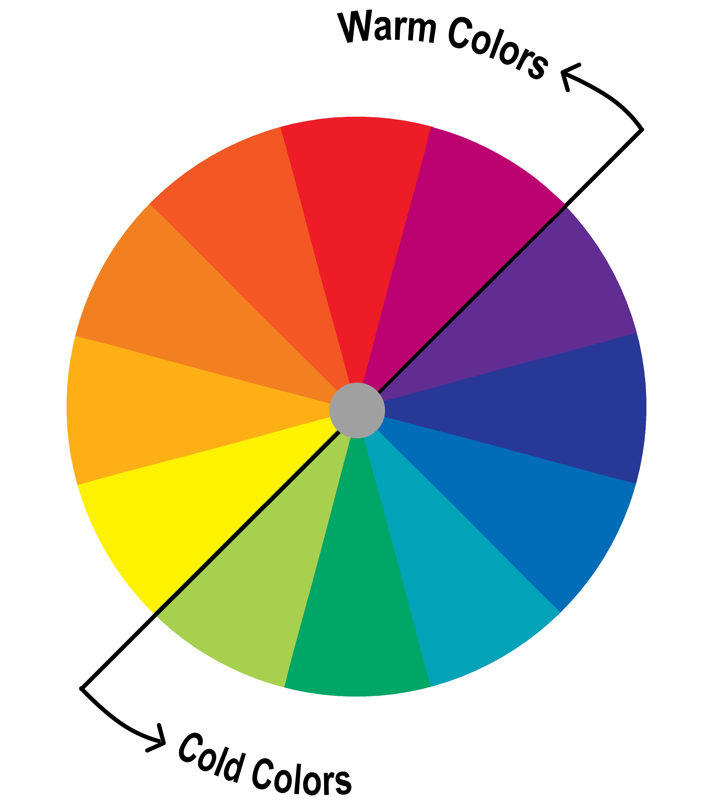

# Modul 1 Antarmuka Manusia dan Komputer
## Kegiatan 1 Antarmuka Manusia dan Komputer

### Antarmuka Manusia dan Komputer
Prinsip dasar sistem komputer terdiri dari tiga tahap utama:
1. **Masukan (Input):** Pengguna memberikan data berupa angka atau deretan karakter kepada komputer.
2. **Proses (Process):** Komputer mengolah data masukan tersebut.
3. **Keluaran (Output):** Hasil olahan ditampilkan ke layar atau pencetak.

Interaksi terjadi melalui Antarmuka (Interface). Antarmuka yang baik memiliki sifat konsisten, seperti pada paket Microsoft Office (Word, Excel, PowerPoint), sehingga pengguna yang sudah mempelajari satu aplikasi dapat dengan mudah mempelajari aplikasi lainnya.

### Contoh Interaksi melalui Pemrograman
Interaksi manusia dan komputer dapat diimplementasikan melalui kode program sederhana:
1. **Python (Gambar 1.4.a):** Menggunakan statemen raw_input dan input untuk meminta masukan dari pengguna, serta statemen print untuk mencetak keluaran. Perbedaannya: raw_input menerima sembarang karakter, sedangkan input hanya menerima data angka.
2. **Java (Gambar 1.5):** Menggunakan class Scanner dengan metode `nextLine()` untuk input teks dan nextInt() untuk input angka.

### Definisi dan Ruang Lingkup IMK
Interaksi Manusia dan Komputer (IMK) adalah disiplin ilmu yang mempelajari perancangan, implementasi, dan evaluasi sistem komputasi interaktif.
* **Interaksi:** Hubungan dua arah antara pengguna dan sistem komputer yang saling mendukung.
* **Mesin:** Mencakup komputer personal (workstation, laptop) hingga mesin komputasi terpadu seperti mesin cuci, kokpit pesawat, atau microwave.
* **Manusia:** Bisa berupa individu, sekelompok orang dalam organisasi, atau sistem terdistribusi.

### Bidang Ilmu Pendukung IMK
IMK merupakan ilmu multidisiplin yang melibatkan berbagai bidang:
* **Ilmu Komputer:** Perancangan aplikasi, teknik pemrograman, dan struktur data.
* **Psikologi:** Membahas proses kognitif dan perilaku pengguna.
* **Antropologi:** Interaksi antara teknologi, kerja, dan organisasi.
* **Sosiologi:** Pengaruh sistem terhadap struktur sosial.
* **Perancangan Grafis dan Tipografi:** Penggunaan gambar sebagai sarana dialog yang efektif.
* **Teknik Elektronika:** Berhubungan dengan aspek perangkat keras komputer.
* **Ergonomi:** Berhubungan dengan aspek fisik dan kenyamanan lingkungan kerja.
* **Linguistik:** Penggunaan bahasa untuk dialog antara manusia dan mesin.
* **Perancangan Industri:** Membahas produk interaktif seperti teknologi layar sentuh.

## Kegiatan Belajar 2 Pengembangan Antarmuka
### Peranti Bantu Pengembang Sistem
Merancang antarmuka yang ramah pengguna (user-friendly) adalah pekerjaan sulit karena harus menangani berbagai peranti kontrol secara asinkron dan keberagaman kebiasaan pengguna.

#### Sejarah & Perkembangan:
* **Tahun 1980-an:** MacApp dari Apple berhasil mempercepat waktu pengembangan hingga 4-5 kali lipat.
* **Era Modern:** Penggunaan kompilator visual berbasis .NET (Visual BASIC, C#) dan peranti berbasis web (FrontPage, Dreamweaver) untuk pembuatan prototipe cepat.

#### Keuntungan Menggunakan Peranti Bantu:
* **Kualitas Antarmuka:** Hasil rancangan lebih baik, mudah dimodifikasi, konsisten, dan memungkinkan kolaborasi antar ahli (grafis, psikolog, spesialis human factor).
* **Ekonomi & Pemeliharaan:** Program lebih terstruktur/modular, kode dapat digunakan kembali (reusable), keandalan lebih tinggi, dan mudah dipindahkan (porting) ke lingkungan lain.

### Strategi Pengembangan Antarmuka
Sebuah program aplikasi terdiri dari dua bagian utama yang seringkali membutuhkan usaha pengembangan yang sama besarnya (40-50% dari total statemen/memori):
* **Bagian Antarmuka (Interface):** Berfungsi sebagai sarana dialog antara manusia dan komputer.
* **Bagian Aplikasi:** Berfungsi menghasilkan informasi berdasarkan algoritma tertentu.

### Tahapan Garis Besar Pengembangan
Pengembangan bagian antarmuka perlu memperhatikan empat hal berikut:
* Pengetahuan Mekanisme Fungsi Manusia: Memahami psikologi kognitif, tingkat perseptual, dan kemampuan motorik pengguna.
* Karakteristik Dialog: Memperhatikan ragam dialog, struktur, tanggapan waktu, dan kecepatan tampilan.
* Penggunaan Prototipe: Berdasarkan spesifikasi dialog formal yang disusun bersama calon pengguna dan perancang sistem.
* Teknik Evaluasi: Mengevaluasi hasil prototipe melalui analisis transaksi dialog, uji coba empiris, umpan balik pengguna (kuesioner), dan analisis ahli.
___

# Modul 2 Faktor Manusia

## Kegiatan 1 Pemodelan Sistem Pengolah (Downtown dan Leedham 1992)
### Pemodelan Sistem Pengolah
Sistem komputer terdiri dari hardware, software, dan brainware. Manusia dimodelkan sebagai sistem pengolah informasi yang memiliki siklus interaksi (masukan $\rightarrow$ pengolah $\rightarrow$ keluaran).
1. **Pengolahan (secara) Sadar dan Otomatis**
    * Sadar: Membutuhkan waktu lama, terjadi pada tindakan baru atau jarang dilakukan.
    * Otomatis: Berlangsung cepat seperti refleks, terjadi karena latihan dan pengalaman (tindakan rutin).
2. **Register Sensori**
    * Berfungsi sebagai penyangga (`buffer`) informasi tak terproses dari indra.
    * Persistensi visual sekitar 0,2 detik dan pendengaran sekitar 2 detik.
3. **Kanal Kapasitas Rendah**
    * Manusia memiliki keterbatasan untuk memproses semua masukan secara serentak.
    * Pengguna harus berkonsentrasi pada bagian tertentu dari medan indra agar informasi dapat diproses.
4. **Pengingat Jangka Pendek**
    * Kapasitas sangat terbatas, yaitu sebesar $7 \pm 2$ chunk (unit informasi).
    * Waktu simpan sangat singkat (20–30 detik) sebelum informasi hilang atau diteruskan.
5. **Pengingat Jangka Panjang**
    * Memiliki kapasitas sangat besar dan bersifat permanen.
    * Penyimpanan berbasis semantik (makna) dan diakses secara asosiatif.
6. **Sikap dan Kecemasan Pengguna**
    * Rasa takut salah atau takut merusak sistem dapat menghambat proses belajar.
    * Desain antarmuka yang ramah dan instruktif sangat penting untuk mengurangi kecemasan.

### Pengendali Motorik
    Respon fisik manusia terhadap hasil pengolahan (tangan, kaki, suara). Kecepatan pengendalian (seperti mengetik) dapat ditingkatkan secara signifikan melalui latihan yang konsisten.

## Kegiatan Belajar 2 Panca Indra dan Lingkungan Sekitar
### Indra Penglihatan
Mata digunakan untuk menghasilkan persepsi terorganisir mengenai gerakan, ukuran, bentuk, jarak, posisi, tekstur, dan warna. Dalam sistem komputer, mata "dipaksa" menginterpretasikan obyek dua dimensi di layar sebagai obyek tiga dimensi.
* **Luminansi (luminance)**
    * Jumlah cahaya yang dipantulkan permukaan obyek (satuan: lilin/meter persegi).
    * Luminansi tinggi meningkatkan kedalaman fokus namun membuat mata sensitif terhadap kedipan (flicker).
* **Kontras**
    * Hubungan antara cahaya obyek dan latar belakangnya (selisih luminansi).
    * Nilai kontras dapat positif (cahaya lebih besar) atau negatif tergantung mana yang lebih besar antara obyek atau latar belakang.
* **Kecerahan**
    * Tanggapan subjektif terhadap cahaya. Luminansi tinggi berimplikasi pada kecerahan yang tinggi pula.
    * Fenomena kisi-kisi Herman menunjukkan ilusi titik hitam/putih pada perpotongan garis akibat perbedaan kecerahan.
* **Sudut dan Ketajaman Penglihatan**
    * Sudut penglihatan (*visual angle*) adalah sudut yang berhadapan dengan obyek pada mata.
    * Ketajaman penglihatan (*visual acuity*) adalah sudut minimum mata untuk melihat obyek dengan jelas.
    * Rumus sudut penglihatan: $\phi = 120 \tan^{-1} \frac{L}{2D}$ (L = tinggi obyek, D = jarak).
* **Medan Penglihatan**
    * Sudut yang dibentuk saat mata bergerak ke kiri dan kanan terjauh. Terbagi menjadi:
      * **Binokuler:** Kedua mata mampu melihat obyek yang sama ($62^\circ - 70^\circ$) dengan daerah sebesar $30^\circ$.
      * **Monokuler:** Dilihat oleh salah satu mata saja ($94^\circ - 104^\circ$).
      * **Area Buta:** Tidak dapat dilihat oleh kedua mata.
    * Medan penglihatan optimum untuk pekerjaan interaktif adalah $\pm 15^\circ$.
* **Warna**
    * Cahaya tampak berada pada spektrum 400–700 nm. Mata mampu membedakan sekitar 128 warna berbeda, dan mata dapat membedakan warna secara akurat saat membentuk sudut $60^\circ$.
    * Psikologi Warna: Warna adalah sensasi sistem saraf. Lensa mata tidak dapat mengoreksi warna secara otomatis (*chromostereopsis*), sehingga warna merah tampak lebih dekat dan biru lebih jauh.
    * Transmisitas Lensa : Lensa menyerap energi spektrum biru dua kali lebih banyak daripada merah/kuning. Penuaan menyebabkan efek "penguningan" lensa, yang mereduksi sensitivitas terhadap panjang gelombang pendek (biru).
    * Persepsi: Penglihatan malam diatur oleh sel rods (tidak peka warna), sedangkan penglihatan warna oleh sel cones (biru, hijau, merah). Buta warna terjadi karena hilangnya fotopigmen tertentu.

#### Saran Penggunaan Warna
Penggunaan warna harus diatur agar tidak menimbulkan ketidaknyamanan mata dan mempermudah pengelompokan informasi.
* **Aspek Psikologis**
    * Gunakan kombinasi warna terbaik berdasarkan latar belakang (lihat Tabel 2.2).
    * Hindari warna biru murni untuk teks atau garis tipis.
    * Gunakan warna berlawanan secara bersamaan (merah-hijau atau kuning-biru) untuk tampilan sederhana. 
* **Aspek Perseptual**
    * Ketajaman dan kecerahan pada layar tidak sama dengan media cetak.
    * Hindari diskriminasi warna pada area kecil; gunakan warna akromatis (hitam, putih, abu-abu) untuk detail tajam.
* **Aspek Kognitif**
    * Jangan gunakan warna berlebihan (maksimal 4-5 warna).
    * Gunakan warna yang sama untuk pesan yang serupa.
    * Warna hangat (panjang gelombang besar) untuk menunjukkan tindakan atau tanggapan yang diperlukan.

#### Optimasi Kombinasi Warna

| Latar Belakang | Rekomendasi Warna Objek (Garis/Teks)  |
| -------------- | ------------------------------------- |
| Putih          | Biru (94%), Hitam (63%)               |
| Hitam          | Putih (75%), Kuning (63%), Biru (81%) |
| Merah          | Kuning (75%), Magenta (81%)           |
| Hijau          | Hitam (100%), Cyan (81%)              |
| Biru           | Putih (81%), Kuning (62%)             |

### Indra Pendengaran
Pendengaran adalah indera terpenting kedua setelah penglihatan dalam IMK, terutama untuk umpan balik (feedback) multimedia.
* **Frekuensi dan Sensitivitas**
    * Manusia mendeteksi suara pada rentang 20 Hz – 20 kHz.
    * Telinga paling sensitif pada frekuensi 1000 – 4000 Hz.
* **Kebisingan (Loudness)**
    * Diukur dalam satuan Desibel (dB). Percakapan biasa berkisar 50 dB – 70 dB.
    * Suara di atas 140 dB dapat menyebabkan kerusakan telinga.
    * Sensitivitas terhadap frekuensi berkurang jika tingkat kebisingan di bawah 20 dB.

### Indra Peraba
Penting sebagai sarana interaksi ketiga, terutama bagi penyandang tunanetra atau untuk aspek ergonomis.
* **Sensitivitas Tekanan**
    * Jari jemari sangat sensitif terhadap perubahan tekanan, namun sensasi ini akan turun jika tekanan bersifat konstan.
    * Implementasi pada papan ketik (keyboard) sangat dipengaruhi oleh posisi dan bentuk tombol. Tombol yang terlalu berat atau ringan dapat mengganggu kinerja pengetikan.

### Lingkungan Sekitar
Interaksi manusia-komputer dipengaruhi oleh kondisi lingkungan tempat sistem tersebut digunakan.
* **Lingkungan Sosial**
    * Mempengaruhi cara orang berinteraksi melalui komputer (sistem kolaboratif).
    * Ubiquitous Computing: Komputer publik (seperti ATM) harus menjaga privasi pengguna, sementara umpan balik suara harus disesuaikan agar tidak mempermalukan pengguna di depan umum.
* **Lingkungan Kognitif**
Perancangan harus mempertimbangkan dinamika kognitif pengguna:
    * Umur: Anak-anak membutuhkan tantangan yang sepadan dengan kemampuan (Flow Theory) agar tidak bosan atau frustrasi. Pengguna ahli mungkin menganggap animasi tertentu menjengkelkan.
    * Disabilitas: Pentingnya perancangan perkakas informasi yang aksesibel bagi penyandang disabilitas.
    * Derajat Pengetahuan Teknis: Fungsionalitas sistem harus disesuaikan dengan latar belakang teknis pengguna agar efisien.
    * Fokus: Sistem harus mendukung tingkat fokus yang berbeda (misal: pemain game vs pengawas polusi suara).
    * Tekanan Kognitif: Lingkungan dengan risiko tinggi (medis, militer, penerbangan) membutuhkan antarmuka yang sangat jelas dan tidak membingungkan karena tidak ada toleransi terhadap kesalahan.
___

# Modul 3 Kerangka Kerja dan Paradigma Interaksi

## Kegiatan 1 Kerangka Kerja untuk Memahami Interaksi
### Siklus Tindakan Eksekusi/Evaluasi
Donald Norman (1990) memperkenalkan konsep siklus tindakan eksekusi/evaluasi untuk memahami bagaimana manusia berinteraksi dengan obyek di dunia nyata.
* **Empat Bagian Dasar:**
    * **Gol (goal):** Kejadian spesifik yang diinginkan oleh pengguna.
    * **Eksekusi:** Melakukan tindakan nyata di dunia nyata.
    * **Dunia Nyata:** Tempat manipulasi obyek terjadi.
    * **Evaluasi:** Validasi hasil tindakan dengan membandingkannya terhadap gol awal.
* **Tujuh Langkah Tindakan:**
Siklus di atas dijabarkan menjadi tujuh langkah operasional:
    * **Fase Eksekusi:** (**1**) Menentukan gol, (**2**) Membentuk keinginan, (**3**) Menentukan urutan tindakan, (**4**) Mengeksekusi tindakan.
    * **Fase Evaluasi:** (**5**) Memahami status dunia nyata, (**6**) Menginterpretasikan persepsi, (**7**) Mengevaluasi hasil interpretasi.
* **Jarak Pemisah (Gulfs):**
    * **Jarak Pemisah Eksekusi:** Perbedaan antara keinginan pengguna dengan apa yang dapat dilakukan sistem. Semakin besar jarak ini, semakin besar potensi frustrasi pengguna.
    * **Jarak Pemisah Evaluasi:** Tingkat kesulitan pengguna untuk mengartikan status sistem (misal: apakah proses instalasi sedang berjalan atau berhenti).

### Kerangka Kerja Interaksi
Abowd dan Beale memperluas siklus Norman dengan memasukkan elemen sistem secara eksplisit. Kerangka kerja ini terdiri atas empat komponen utama:
* **Komponen Utama:**
    * **Sistem (S):** Menggunakan bahasa mesin (atribut komputasi).
    * **Pengguna (P):** Menggunakan bahasa tugas (atribut psikologis).
    * **Masukan (M):** Menggunakan bahasa masukan.
    * **Keluaran (K):** Menggunakan bahasa keluaran.
* **Fase Interaksi:**
    * **Fase Eksekusi:**
        * **Artikulasi:** Pengguna memformulasikan gol ke dalam bahasa masukan.
        * **Pengerjaan:** Bahasa masukan diterjemahkan ke dalam bahasa mesin oleh sistem.
        * **Penyajian:** Sistem menyajikan hasil operasi dalam bahasa keluaran.
    * **Fase Evaluasi:**
        * **Observasi:** Pengguna mengartikan hasil di layar dan mencocokkannya dengan gol semula.
* **Analisis Kesulitan:**
    * Kesulitan sering muncul pada langkah Artikulasi jika pemetaan antara bahasa tugas dan bahasa masukan tidak jelas (misal: bingung mencari ikon untuk fungsi tertentu).
    * Keberhasilan Penyajian diukur dari tingkat ekspresivitas penerjemah status sistem (misal: penggunaan ikon jam pasir untuk menunjukkan sistem sedang bekerja).

## Kegiatan 2 Mengatasi Kompleksitas
### Model Mental
Model mental adalah penyajian kognitif tentang perkiraan logis bagaimana suatu benda dibentuk atau berfungsi.
* **Affordance:** Atribut obyek yang memberikan petunjuk penggunaan (contoh: gagang pisau untuk digenggam).
* **Karakteristik Model Mental:**
    * Tidak ilmiah: Berdasarkan perkiraan atau tebakan.
    * Tidak lengkap: Tidak menjelaskan sistem secara keseluruhan.
    * Tidak stabil: Beradaptasi dengan konteks.
    * Tidak konsisten: Sering tidak kompatibel satu dengan lainnya.
    * Personal: Unik untuk setiap individu.
* **Model Konseptual vs Model Mental:**
    * Model Konseptual: Model yang diciptakan oleh perancang untuk sistem.
    * Gambaran Sistem: Dokumentasi dan antarmuka yang terlihat oleh pengguna.
    * Model Mental (Pengguna): Diciptakan pengguna saat berinteraksi dengan gambaran sistem.
    * Idealnya: Model mental pengguna harus sama dengan model konseptual perancang.

### Pemetaan
Konsep tentang bagaimana pengguna menghubungkan satu benda dengan benda lain.
* **Pemetaan Alami:** Tata letak yang intuitif (contoh: saklar kiri mengendalikan lampu kiri).
* **Pemetaan Sembarangan:** Memaksa pengguna mengingat hubungan yang tidak logis, sering memicu kesalahan.

### Jarak Semantik dan Artikulatori
* **Jarak Semantik:** Jarak antara fungsionalitas yang tersedia dengan apa yang ingin dilakukan pengguna. Berkaitan dengan kedayagunaan (usefulness).
* **Jarak Artikulatori:** Jarak antara penampakan fisik peranti dengan fungsinya yang sesungguhnya.

### Affordance
Hubungan antara obyek dengan pengguna melalui persepsi.
* Perancang harus meyakinkan bahwa affordance nampak nyata dan tidak kontradiktif (contoh kesalahan: kotak teks yang terlihat seperti tombol label, atau sebaliknya).
* Persepsi yang tepat terhadap affordance membantu pengguna memahami kebergunaan (usability) sistem.

## Kegiatan 3 Paradigma Interaksi
### Antarmuka Berpusat-Pada-Implementasi (BPI)
Antarmuka ini diekspresikan berdasarkan cara sistem dibentuk atau cara kerjanya.
* **Landasan:** Pemahaman tentang mekanisme program (satu tombol untuk satu fungsi, satu dialog untuk satu modul).
* **Karakteristik:** Sangat memuaskan bagi insinyur/perancang yang ingin tahu cara mesin bekerja, namun seringkali menyulitkan pengguna awam karena terlalu kompleks.

### Antarmuka Metaforik
Bergantung pada hubungan intuitif antara simbol visual dengan fungsinya berdasarkan benda nyata di dunia maya.
* **Landasan:** Intuisi pengguna. Contoh: ikon gunting untuk memotong (cut), ikon buku cek untuk pembayaran.
* **Kelebihan:** Membantu pengguna mengenali maksud komponen secara instan jika metaforanya tepat.

### Keterbatasan Metorik
Meskipun populer, paradigma metaforik memiliki risiko yang signifikan:
* **Sulit Ditemukan:** Tidak semua fungsi aplikasi memiliki padanan benda nyata (misal: memutar perkakas atau mengubah resolusi layar).
* **Membatasi Kemampuan Pikir:** Memaksa pengguna mengikuti logika mekanis benda nyata yang mungkin tidak efisien di komputer.
* **Ketergantungan Budaya:** Simbol tertentu mungkin tidak dipahami oleh pengguna dari latar belakang budaya berbeda.
* **Masalah Skalabilitas:** Metafora yang cocok untuk kapasitas kecil (misal: floppy disk) menjadi tidak relevan untuk kapasitas besar (TB).

### Antarmuka Idiomatik
Paradigma ini didasarkan pada cara manusia belajar menggunakan "idiom" visual tanpa harus tahu mekanisme teknis atau kaitan metaforiknya.
* **Landasan:** Pembelajaran dan ingatan pengguna terhadap perilaku sederhana.
* **Karakteristik:** Tidak fokus pada "bagaimana benda berfungsi" tetapi pada "bagaimana cara menggunakannya secara cepat".
* **Contoh:** Jendela (windows), papan judul (title bars), hyperlink, dan dropdown. Kebanyakan elemen grafis yang kita anggap "intuitif" sebenarnya adalah idiom visual.
  
### Membangun Idiom
Menurut Cooper dan Reimann (2003), perancangan idiomatik adalah masa depan antarmuka.
* Manusia memiliki kemampuan belajar idiom yang sangat cepat tanpa perlu perbandingan dengan benda nyata.
* Idiom visual lebih fleksibel dan memberikan manfaat yang lebih besar dibandingkan beban tambahan dari metafora yang dipaksakan.
___

# Modul 4 Kebergunaan

## Kegiatan 1 Kesalahan Klasik dan Kepuasaan Berinteraksi
### Kesalahan Klasik
Kesalahan ini sering dilakukan oleh perancang sistem karena asumsi yang salah, yang berakibat pada ketidakpuasan pengguna.
1. Perancangan yang hanya didasarkan pada common-sense.
2. Anggapan perilaku individu mewakili seluruh kelompoknya.
3. Menuruti keinginan atasan tanpa pertimbangan teknis/pengguna.
4. Terpaku pada kebiasaan atau tradisi lama.
5. Anggapan implisit yang tidak didukung data.
6. Keputusan perancangan awal yang tidak didukung fakta.
7. Penundaan evaluasi dengan alasan "sampai waktu luang".
8. Evaluasi formal menggunakan kelompok subyek yang tidak sesuai.
9. Eksperimen yang tidak dapat dianalisis.

### Kepuasan Berinteraksi
Kepuasan adalah kriteria penting untuk menentukan kebergunaan (usability) sistem, yang dapat diuji melalui data kuantitatif maupun investigasi kualitatif.
* Kepuasan dapat dicapai jika sistem memenuhi **Delapan Aturan Shneiderman (1998):**
    * **Konsistensi:** Urutan tindakan, terminologi, warna, tata letak, dan jenis huruf harus konsisten di seluruh sistem.
    * **Fasilitas Kunci-Cepat:** Mendukung singkatan, kunci khusus, dan fasilitas makro untuk pengguna berpengalaman (frequent user).
    * **Umpan Balik yang Informatif:** Setiap tindakan pengguna harus mendapat tanggapan yang jelas dari sistem.
    * **Rancangan Dialog untuk Penutupan (Closure):** Urutan tindakan harus terorganisir dengan bagian awal, tengah, dan akhir yang memberikan rasa lega bagi pengguna.
    * **Pencegahan dan Penanganan Kesalahan:** Sistem harus mencegah pengguna membuat kesalahan serius dan memberikan instruksi pemulihan yang sederhana jika terjadi kesalahan.
    * **Pembalikan Tindakan yang Mudah:** Tindakan harus dapat dibatalkan (reversible) untuk mengurangi kecemasan dan mendorong eksplorasi.
    * **Dukungan pada Locus of Control Internal:** Pengguna harus merasa bahwa merekalah yang menguasai sistem, bukan sebaliknya.
    * **Pengurangan Beban Memori Jangka Pendek:** Tampilan harus sederhana, konsolidasi jendela harus dilakukan, dan waktu pelatihan harus cukup agar pengguna tidak perlu menghafal terlalu banyak kode/perintah.

## Kegiatan 2 Kebergunaan
### Definisi Kebergunaan
Kebergunaan didefinisikan sebagai derajat kemampuan perangkat lunak untuk membantu pengguna menyelesaikan tugas.
* **Kombinasi "Guna" (Dix et al., 2004):**
    * Berguna (**useful**): Sistem berfungsi sesuai keinginan pengguna.
    * Dapat digunakan (**usable**): Sistem mudah dioperasikan.
    * Digunakan (**used**): Sistem memotivasi pengguna (menarik, menyenangkan).
* **Lima Komponen Kualitas (Nielsen, 2003):**
    * Kemampuan untuk dipelajari (**learnability**): Seberapa cepat pengguna memahami cara kerja sistem.
    * Efisiensi (**efficiency**): Seberapa cepat sistem mendukung pekerjaan (misal: fitur one-click Amazon).
    * Mudah diingat (**memorability**): Kemampuan pengguna menggunakan kembali sistem setelah periode waktu tertentu tanpa belajar dari awal.
    * **Kesalahan dan keamanan**: Melindungi pengguna dari kondisi berbahaya/tidak diinginkan dan menyediakan fasilitas pemulihan (recovery atau undo).
    * Kepuasan (**satisfaction**): Seberapa jauh pengguna menyukai sistem tersebut.

### Uji Keberagaman
Proses mengukur karakteristik interaksi dan mengidentifikasi kelemahan sistem.
* **Jenis Uji (Levi dan Conrad, 1997):**
    * **Uji Eksploratori:** Mencari titik-titik kebingungan pengguna (dilakukan sejak awal pengembangan).
    * **Threshold Testing:** Mengukur kinerja terhadap sasaran tertentu (lolos/gagal, misal: menyelesaikan tugas $x$ dalam $y$ detik).
    * **Uji Perbandingan:** Menentukan rancangan mana yang lebih cocok bagi pengguna.
* **Uji Formatif vs Sumatif (Hilbert dan Redmiles, 2000):**
    * **Uji Formatif:** Memberikan umpan balik kepada perancang untuk perbaikan (saat proses).
    * **Uji Sumatif:** Memberikan penilaian terhadap produk jadi atau membandingkannya dengan produk lain.

### Metode Uji Keberagaman
Terdapat tiga metode utama yang dijelaskan dalam materi:
* **Pemilahan Kartu (Card Sorting):**
    * Pengguna mengelompokkan kartu berlabel ke dalam kategori yang masuk akal bagi mereka.
    * Sangat berguna untuk membangun struktur menu dan hirarki hyperlink yang intuitif pada situs Web.
* **Evaluasi Heuristik:**
    * Melibatkan ahli AMK untuk mengeksplorasi sistem berdasarkan prinsip kebergunaan.
    * Evaluator mengidentifikasi masalah, mencocokkannya dengan heuristik, dan menentukan nilai kegawatan (skala 5-poin).
* **Uji Berbasis Skenario:**
    * Menggunakan partisipan (pengguna akhir) untuk menyelesaikan tugas atau skenario tertentu yang sudah dirancang.
    * Aktivitas dicatat (misal menggunakan log) dan hasilnya dianalisis secara empiris untuk memperbaiki sistem.
___

# Modul 5 Manipulasi Langsung

## Kegiatan 1 : Manipulasi Langsung
### Aspek Kognitif Pada Manipulasi Langsung
Manipulasi langsung adalah ragam dialog di mana pengguna melakukan tindakan fisik (seperti menggeser berkas ke kotak sampah) yang hasilnya langsung terlihat secara visual.
* **Directness (Kesan Langsung):** Terbagi menjadi dua aspek:
    * **Jarak (Distance):** Jarak antara apa yang dipikirkan pengguna dengan kebutuhan fisik sistem. Jarak pendek berarti sistem mendukung tujuan pengguna dengan mudah.
    * **Keterlibatan (Engagement):** Perasaan kualitatif seolah pengguna memanipulasi obyek secara langsung (seperti bermain kartu Solitaire), bukan sekadar menjalankan perintah komputer.
* **Metafora Model Dunia:** Antarmuka harus menyajikan obyek yang terasa nyata bagi pengguna. Pengguna tidak lagi menggunakan "bahasa percakapan" (mengetik perintah), tetapi melakukan tindakan langsung pada representasi obyek tersebut.

### Manipulasi Program Vs Manipulasi Isi
* **Manipulasi Program:** Berfokus pada pengelolaan program itu sendiri (memilih, menggeser, mengubah ukuran jendela, atau menghubungkan obyek).
* **Manipulasi Isi:** Berfokus pada data di dalam program. Contohnya pada aplikasi grafis seperti CorelDRAW atau Photoshop, di mana pengguna secara langsung mengubah bentuk atau warna elemen visual.

### Fase Pada Proses Manipulasi Langsung
Terdapat tiga fase utama dalam interaksi manipulasi langsung:
* **Fase Bebas:** Sebelum tindakan dilakukan (kursor bergerak bebas di atas obyek).
* **Fase Aktivasi:** Pengguna mulai melakukan tindakan fisik (misal: klik dan geser).
* **Fase Penghentian:** Pengguna melepas tindakan dan sistem menunjukkan hasilnya secara pasti.

### Umpan Balik Visual
Keberhasilan manipulasi langsung sangat bergantung pada umpan balik visual yang lengkap:
* Perubahan bentuk kursor (misal: menjadi simbol tangan saat menggeser).
* Penggunaan kunci-meta (seperti Ctrl atau Shift) untuk operasi tambahan seperti penggandaan obyek.
* Visualisasi garis batas saat menggeser obyek yang kompleks untuk menjaga performa sistem.

### Penerapan Manipulasi Langsung
Penerapan manipulasi langsung ditemukan pada berbagai bidang:
* **Kontrol Proses:** Panel kontrol industri berbasis grafis (misal: pembangkit listrik).
* **Editor Teks:** Konsep WYSIWYG (What You See Is What You Get).
* **Simulator:** Simulator pesawat terbang yang meniru kokpit nyata.
* **Kontrol Lalu Lintas Penerbangan:** Sistem radar yang merefleksikan posisi pesawat secara real-time.
* **Perancangan Terbantu Komputer (CAD):** Penggunaan AutoCAD untuk merancang model 3D.

### Keuntungan dan Kerugian Manipulasi Langsung
| Keuntungan                                           | Kerugian                                                     |
| :--------------------------------------------------- | :----------------------------------------------------------- |
|                                                      |
| Mempunyai analogi yang jelas dengan pekerjaan nyata. | Memerlukan program yang rumit dan berukuran besar.           |
| Mengurangi waktu pembelajaran bagi pengguna.         | Memerlukan tampilan grafis berkinerja tinggi.                |
| Memberikan tantangan untuk eksplorasi pekerjaan.     | Memerlukan peranti masukan khusus (mouse, trackball).        |
| Penampilan visual yang bagus dan mudah dioperasikan. | Memerlukan perancangan tampilan dengan kualifikasi tertentu. |

## Kegiatan 2 : Piranti Penunjuk
### Piranti Penunjuk
Tetikus (mouse) adalah peranti interaktif paling populer untuk menempatkan kursor, mengaktifkan menu, hingga menggambar. Informasi posisi dikirim ke komputer untuk memindahkan kursor secara real-time.
* **Variasi Tombol:**
    * Satu Tombol (Apple/Macintosh): Menekankan pada kesederhanaan, meski pengguna harus sering mengulang klik untuk perintah tertentu.
    * Dua Tombol (Microsoft/Windows): Menambah kombinasi informasi (klik kiri dan kanan).
    * Tiga Tombol (Unix/Sun): Memungkinkan hingga 7 kombinasi berbeda (sering digunakan untuk aplikasi teknis tertentu).

### Penggunaan Mouse
Penggunaan tombol kanan mulai populer sejak Windows 95 untuk mengakses context menu (properti obyek), yang sebelumnya dianggap opsional oleh perancang lain.
* **Tombol Kiri:** Digunakan untuk fungsi manipulasi langsung (mengaktifkan, memilih, menggambar). Ini adalah fungsi utama untuk pemilihan data.
* **Tombol Kanan:** Digunakan untuk fungsi tingkat tinggi atau tambahan, seperti memunculkan kotak dialog properti obyek.
* **Tombol Tengah:** Jarang dimanfaatkan di pasaran umum, biasanya digunakan untuk tombol singkat atau pengaturan driver khusus.

### Menunjuk dan Mengklik Menggunakan Mouse
Interaksi dasar manusia dengan mouse melibatkan kombinasi operasi berikut:
* **Menunjuk:** Dasar dari semua operasi; menggerakkan kursor hingga berada di atas obyek. Obyek dapat "merasakan" kehadiran kursor (disebut pliansi atau pliancy).
* **Meng-klik:** Menekan dan melepas tombol. Digunakan untuk memicu perubahan status obyek atau memilihnya. Sistem juga menyediakan "rute keluar" jika pengguna menekan tombol tapi tidak jadi melepasnya di atas obyek (berubah pikiran).
* **Meng-klik dan Menggeser:** Operasi umum untuk memilih banyak obyek, mengubah bentuk, memindah obyek (drag and drop), atau menggambar.
* **Meng-klik Ganda:** Dianggap sebagai dua kali klik tunggal, namun secara fungsional berbeda. Klik tunggal biasanya untuk memilih (select), sedangkan klik ganda untuk melakukan tindakan (action/open).
___

# Modul 6 Antarmuka Berbasis Menu

## Kegiatan 1 Menu
### Organisasi Menu Berbasis Tugas
Tujuan utama perancangan menu adalah menciptakan struktur yang pantas, intuitif, dan sesuai dengan tugas pengguna.
* **Struktur Organisasi:**
    * Hirarkis: Pemecahan menu secara logis (seperti bab dalam buku).
    * Jejaring Menu: Item yang memiliki lebih dari satu kategori induk.
* **Kategori Menu:**
    * Menu Tunggal: Pilihan sederhana.
    * Urutan Linear: Menuntun pengguna setahap demi setahap.
    * Struktur Pohon: Paling umum, memiliki cabang sub-menu.
    * Jaring Menu: Terbagi menjadi jaring tidak berputar dan jaring berputar (siklik).

### Menu Tunggal
Menu yang mengharuskan pengguna memilih satu atau lebih opsi dari sekumpulan pilihan yang tersedia.
* **Menu Biner:** Hanya dua pilihan (Ya/Tidak). Menggunakan warna atau garis bawah untuk pilihan standar.
* **Menu Tunggal dengan Banyak Pilihan:** 
    * Tombol Radio (radio button): Pilih satu dari banyak.
    * Kotak Cek (checkbox): Pilih lebih dari satu.

### Variasi Jenis Menu
Teknik penyajian menu untuk efisiensi ruang layar:
* **Menu Datar dan Selektor Pilihan:** Menampilkan seluruh pilihan di satu layar.
    * Selektor Kompatibel: Menggunakan huruf awal kata (misal: B untuk Baca). Paling mudah diingat.
    * Selektor Tak Kompatibel: Menggunakan angka atau huruf sembarang.
* **Menu Tarik (dropdown):** Menghemat ruang dengan menyembunyikan pilihan di bagian atas jendela.
    * Simbol (...): Memanggil kotak dialog.
    * Simbol ($\blacktriangleright$): Memiliki sub-menu.
* **Menu Berbasis Ikon dan Toolbar:** Representasi visual untuk akses cepat tanpa teks panjang.
* **Menu dengan Pilihan Panjang:**
    * Menu Gulung (scrolling menu): Pilihan diurutkan alfabetis dalam area terbatas.
    * Kotak Kombo (combo box): Gabungan antara kotak teks dan menu gulung.
    * Menu Mata Ikan (fisheye menu): Menampilkan semua pilihan, namun memperbesar item di dekat kursor.
    * Penggeser (slider): Untuk memilih nilai di antara dua batas.
    * Menu Dua Dimensi: Pilihan disusun dalam bentuk tabel/kisi (seperti menu pada Web).
* **Menu dan Hotlink Tertanam:** Menu yang menyatu dalam teks atau gambar (seperti hyperlink atau balon informasi pada citra satelit).
* **Menu Breadcrumb:** Menampilkan jejak navigasi pengguna (lokasi saat ini dalam hirarki Web).

### Menu Kombinasi
Gabungan berbagai struktur untuk menangani sistem yang sangat kompleks.
* **Menu Linear dan Menu Serempak:**
    * Linear: Untuk pengambilan keputusan berurutan (misal: proses belanja online).
    * Serempak: Menampilkan banyak pilihan sekaligus secara bebas (misal: filter pencarian pada Amazon).
* **Menu Berstruktur Pohon:** Pengelompokan berdasarkan kriteria unik untuk memudahkan pemeliharaan sistem besar.
* **Peta Situs (Sitemap):** Ringkasan seluruh struktur hirarki situs Web untuk mencegah disorientasi pengguna.
* **Jaring Menu Tak Berputar dan Berputar:** Memberikan keleluasaan bergerak antar cabang menu tanpa harus selalu kembali ke menu utama terlebih dahulu.

## Kegiatan 2 Cara Mengorganisasi Pilihan
### Pengelompokkan Berbasis Tugas Pada Struktur Pohon
Pengelompokan pilihan harus logis dan sesuai dengan tugas pengguna agar mudah dipahami.
* **Kategorisasi Logis:** Satukan item yang serupa (misal: nama negara dikuti provinsi, lalu kota).
* **Berdasarkan Nilai:** Pengelompokan berdasarkan kriteria tertentu, seperti rentang umur (0-9, 10-19, dst).
* **Kesesuaian Alamiah:** Hubungkan pilihan secara intuitif, misalnya kategori "Hiburan" yang membawahi "Konser" dan "Olahraga".
* **Istilah Sederhana:** Gunakan istilah yang familiar dan bedakan dengan jelas antar pilihan (misal: "Pagi" vs "Malam").

### Urutan Penyajian Pilihan
Setelah kategori ditentukan, urutan item di dalam menu harus diatur berdasarkan:
* **Dasar Umum:** Waktu (kronologis), numeris (urut naik/turun), atau sifat fisik (berat, panjang, dsb).
* **Kepentingan Tugas:**
    * Item paling penting diletakkan di urutan pertama.
    * Item paling sering digunakan diletakkan di bagian atas.
    * Kelompokkan item yang saling terkait dengan pemisah (garis kosong).
    * Urutan alfabetis untuk daftar yang tidak memiliki hierarki kepentingan.
* **Menu Adaptif:** Variasi di mana item yang jarang digunakan disembunyikan untuk memperpendek daftar (contoh pada Office 2000). Namun, ini bisa membingungkan jika posisi menu berubah-ubah.

### Tata Letak Menu
Penilaian subjektif terhadap tata letak sangat mempengaruhi kebergunaan:
* **Judul Menu:**
    * Gunakan judul yang unik, menarik, dan informatif.
    * Judul harus mencerminkan isi (misal: "Transaksi Bank" lebih jelas daripada "Menu Utama").
    * Pertahankan posisi menu yang tetap agar pengguna tidak perlu mencari ulang.
* **Pemilihan Ungkapan:**
    * Gunakan terminologi yang dikenal dan konsisten.
    * Gunakan ungkapan singkat namun jelas.
    * Gunakan kata kunci sebagai awal ungkapan untuk mempercepat pemindaian visual.
* **Tata Letak Grafis:**
    * Penulisan Judul: Rapi di tengah atau kiri (biasanya kiri lebih disukai untuk kecepatan baca).
    * Penempatan Pilihan: Gunakan nomor atau huruf secara lengkap. Gunakan baris kosong untuk memisahkan kelompok kolom jika daftar sangat panjang.
    * Penunjuk: Gunakan simbol atau tombol fungsi yang seragam untuk setiap menu.
    * Pesan Kesalahan: Harus muncul pada posisi konsisten dengan bahasa yang instruktif.
    * Laporan Status: Tunjukkan posisi pengguna saat ini dalam hierarki (seperti breadcrumb atau perubahan jenis huruf).

___

# Modul 7 Dialog Berbasis Teks dan Pengisian Borang
## Kegiatan 1 Dialog Berbasis Teks
### Dialog Berbasis Perintah Tunggal
Dialog berbasis perintah tunggal (command line dialogue) merupakan ragam interaksi paling konvensional yang bergantung pada sistem komputer dan bahasa perintah (command language) yang digunakan.
* **Karakteristik:**
    * Sifatnya alamiah namun harus dirancang sedemikian rupa agar mudah dipelajari dan diingat.
    * Memiliki struktur leksikal, sintaksis, dan semantik tertentu.
    * Populer pada sistem operasi berbasis teks seperti DOS dan UNIX.
* **Contoh Perintah DOS (Internal & External):**
    * DIR: Menampilkan daftar berkas dalam direktori.
    * COPY: Membuat salinan berkas ke lokasi lain.
    * FORMAT: Menyiapkan disket/media simpan agar dapat digunakan.
    * DELTREE: Menghapus direktori beserta seluruh isinya.
* **Contoh Perintah UNIX:**
    * vi: Editor teks untuk menulis atau membaca berkas.
    * ls: Menampilkan nama berkas dalam akun pengguna.
    * who: Menampilkan daftar pengguna yang sedang aktif.
    * passwd: Mengubah kata kunci (password).
* **Analisis Keuntungan dan Kerugian:**
    * Keuntungan: Cepat, efisien, akurat, ringkas, dan memberikan inisiatif penuh kepada pengguna ahli.
    * Kerugian: Memerlukan pelatihan lama, beban ingatan tinggi terhadap kode perintah, dan buruk dalam menangani kesalahan (error handling).
* **Saran Perancangan:**
    * Pilihlah kata kunci yang mudah diingat dan gunakan untaian kata yang pendek.
    * Gunakan format perintah yang konsisten dan sediakan fasilitas bantuan (help).
    * Sediakan pesan kesalahan yang jelas dan gunakan nilai-nilai default untuk mengurangi ketikan.

### Dialog Berbasis Kombinasi Perintah
Ragam dialog ini memungkinkan pengguna untuk mengemas sejumlah perintah tunggal ke dalam satu bentuk berkas yang sering disebut dengan batch file.
* **Mekanisme:**
    * Digunakan ketika pengguna harus menjalankan sederetan perintah yang sama berulang kali.
    * Dalam DOS, contoh terkenalnya adalah berkas AUTOEXEC.BAT yang berisi urutan perintah untuk mengatur lingkungan sistem saat booting.
* **Fleksibilitas:**
    * Dapat berisi pernyataan logika sederhana seperti IF atau perintah pengulangan FOR untuk otomatisasi tugas yang lebih kompleks.

### Dialog Berbasis Bahasa Alami
Paradigma interaksi ini memungkinkan komunikasi antara manusia dan komputer menggunakan bahasa manusia yang sehari-hari (natural language).
* **Implementasi Teknis:**
    * Membutuhkan sebuah Sistem Penerjemah yang bertindak sebagai perantara antara instruksi bebas manusia dengan instruksi yang dimengerti mesin (seperti SQL atau PHP).
* **Tantangan:**
    * Ambiguitas: Kalimat manusia seringkali mengandung kerancuan yang dapat mengakibatkan salah interpretasi oleh penerjemah komputer.
    * Sintaksis vs Semantik: Meskipun bebas, sistem tetap memiliki batasan dalam memahami arti (semantik) yang sesungguhnya dari sebuah instruksi jika struktur kalimatnya terlalu kompleks atau tidak logis.

## kegiatan 2 Dialog Berbasis Pengisian Borang
Dialog berbasis pengisian borang (form-filling dialogue) adalah teknik antarmuka di mana pengguna dihadapkan pada bentuk borang di layar untuk memasukkan data yang kemudian akan diintegrasikan ke dalam sistem.

### Struktur dan Organisasi
Kualitas antarmuka pengisian borang bergantung pada tiga aspek tampilan yang mencerminkan struktur data masukan:
* **Struktur Data:** Mencerminkan urutan dan pengelompokan informasi yang diperlukan sistem.
* **Visualisasi:** Kejelasan perancangan dan penyajian medan isian pada layar.
* **Manipulasi Langsung:** Jika borang secara langsung mencerminkan keadaan sistem sebenarnya (contoh: borang KTP), maka ia merupakan bentuk manipulasi langsung.
* **Peranti Masukan:** Mengandalkan papan ketik (keyboard) sebagai peranti utama dan tetikus (mouse) untuk menggerakkan kursor.

### Evolusi Dialog Berbasis Pengision Borang
Teknik ini berkembang dari basis teks ke grafis:
* **Dialog Berbasis Tekstual:** Populer pada tahun 1960-an (contoh: PINE 3.96). Memiliki keterbatasan ruang layar dan usaha lebih besar untuk memindahkan kursor antar pilihan karena belum mendukung sistem jendela (windowing).
* **Dialog Berbasis Grafis:** Lebih menarik dan tidak monoton. Menggunakan berbagai komponen seperti:
    * Data field / Text field (medan teks).
    * List box (kotak daftar).
    * Combo box dan Spin box.
    * Editor box.

### Validasi Isian
Perancang harus memastikan data yang dimasukkan benar melalui validasi untuk menghindari kesalahan fatal.
* **Validasi Sisi Klien (Client-side):** Dilakukan sebelum data dikirim ke server. Biasanya menggunakan Javascript.
    * Keuntungan: Lebih cepat karena tidak memerlukan koneksi ke server untuk pengecekan format (misal: format email atau kolom kosong).
* **Validasi Sisi Server (Server-side):** Dilakukan setelah data dikirim ke server.
    * Kegunaan: Untuk pengecekan yang memerlukan data di server (misal: verifikasi login).
    * Kerugian: Proses lebih lambat karena bergantung pada koneksi jaringan.

### Keuntungan dan Kerugian
| Aspek          | Deskripsi                                                                                                                    |
| :------------- | :--------------------------------------------------------------------------------------------------------------------------- |
|                |
| **Keuntungan** | Pengguna terbiasa, isian terstruktur jelas, beban memori rendah, perancangan mudah, tersedia banyak peranti bantu tampilan.  |
| **Kerugian**   | Seringkali lambat, memakan banyak ruang layar, tidak cocok untuk instruksi perintah, memerlukan navigasi kursor (TAB/Mouse). |

### Aspek Perancangan yang Perlu Diperhatikan
* Proteksi tampilan: Pembatasan akses pengguna.
* Batasan medan: Panjang data tetap atau berubah.
* Isi medan: Petunjuk pengisian yang jelas.
* Medan opsional: Penandaan yang jelas (tekstual atau warna).
* Default: Nilai awal yang mungkin disediakan.
* Bantuan (Help): Tersedia jika pengguna kesulitan.
* Medan penghentian: Penggunaan tombol Enter atau Return.
* Navigasi: Penggunaan tombol TAB untuk berpindah medan secara urut.
* Pembetulan kesalahan: Penggunaan tombol Backspace.
* Penyelesaian: Pemberitahuan bahwa proses telah selesai.

___

# Modul 8 Rancangan Tampilan

## Kegiatan 1 Prinsip dan Petunjuk Perancangan
Dokumentasi rancangan adalah elemen krusial untuk memfasilitasi iterasi dan perubahan desain. 
* Metode dokumentasi meliputi: sketsa kertas, prototipe GUI, deskripsi tekstual hubungan antarjendela, dan penggunaan perangkat bantu CASE (Computer-Aided Software Engineering).

### Cara Pendekatan
Pendekatan perancangan dibedakan berdasarkan target pengguna:
* **Special Purpose Software:** Untuk pengguna khusus (misal: inventori gudang). Menggunakan pendekatan User-Centered Design (UCD) di mana pengguna dilibatkan aktif dalam merancang "wajah" antarmuka.
* **General Purpose Software (Public Software):** Untuk pengguna luas dengan tingkat kemahiran beragam. Mengutamakan Customization agar pengguna dapat menyesuaikan antarmuka (misal: pengaturan desktop OS X) sesuai preferensi pribadi.

### Prinsip dan Petunjuk Perancangan
Antarmuka terdiri dari empat komponen utama: **model pengguna**, **bahasa perintah**, **umpan balik**, dan **penampilan informasi**.
* **Urutan Perancangan**
Proses dilakukan secara top-down dan stepwise refinement:
    * Pemilihan Ragam Dialog: Menyesuaikan karakteristik populasi pengguna (mula, menengah, ahli).
    * Perancangan Struktur Dialog: Analisis tugas untuk membentuk alur yang sesuai dengan model mental pengguna.
    * Perancangan Format Pesan: Fokus pada tata letak dan efisiensi input (mengurangi pengetikan yang tidak perlu).
    * Perancangan Penanganan Kesalahan: Meliputi validasi pemasukan data, proteksi tindakan tidak sengaja, pemulihan (recovery), dan pesan kesalahan yang tepat waktu.
    * Perancangan Struktur Data: Menentukan struktur internal untuk mendukung fungsionalitas antarmuka yang telah dibuat.
* **Perancangan Tampilan Berbasis Teks**
Enam faktor utama dalam tata letak tekstual:
    * Urutan Penyajian: Harus selaras dengan model pengguna.
    * Kelonggaran (Spaciousness): Penggunaan tabulasi dan spasi untuk mencegah kepadatan informasi.
    * Pengelompokan: Mengorganisir data yang berkaitan secara logis.
    * Relevansi: Hanya menampilkan pesan yang berkaitan dengan topik di layar.
    * Konsistensi: Menggunakan format yang seragam (misalnya pada sistem berbasis frame).
    * Kesederhanaan: Menyajikan informasi agar mudah dipahami dengan cepat.
* **Perancangan Tampilan Berbasis Grafis**
Lima faktor utama dalam antarmuka GUI:
    * Ilusi pada Obyek yang Dapat Dimanipulasi: Menggunakan kumpulan obyek/ikon yang merepresentasikan fungsi secara konkret.
    * Urutan Visual dan Fokus Pengguna: Penggunaan animasi, warna kontras, atau simbol berkedip untuk mengarahkan perhatian tanpa berlebihan.
    * Struktur Internal: * Reveal Code: Tanda khusus untuk menunjukkan pemformatan (misal pada pengolah kata).
        * Reveal Structure: Menunjukkan batas operasional obyek (misal: object handle pada kotak teks.
    * Kosakata Grafis yang Konsisten: Penggunaan simbol/ikon standar (misal: ikon disket untuk simpan) secara konsisten di berbagai aplikasi.
    * Kesesuaian dengan Media: Mempertimbangkan karakteristik layar (CGA, LCD, bitmap/raster display) dalam menampilkan estetika antarmuka.
* **Waktu Tanggap (Response Time)**
Waktu tanggap adalah durasi yang dibutuhkan sistem untuk merespons instruksi pengguna. Variabel ini dipengaruhi oleh ragam interaksi dan kemahiran pengguna.
    * Waktu Tanggap Kritis:
        * < 2 Detik: Dianggap memadai untuk aktivitas interaktif seperti pemilihan menu atau pengisian borang.
        * Seketika (Instantaneous): Diperlukan untuk pengetikan karakter atau pelacakan kursor mouse.
        * > 14 Detik: Mengakibatkan destruksi konsentrasi pengguna, memicu pengguna beralih ke aktivitas lain.

* **Penanganan Kesalahan**
Kesalahan dalam sistem dibagi menjadi dua kategori fungsional berdasarkan fase deteksinya:
    * **Kesalahan Sintaksis (Compile-time Error)**
Kesalahan yang terjadi akibat pelanggaran aturan penulisan bahasa pemrograman.
        * Deteksi: Dilakukan oleh kompilator secara otomatis.
        * Konsekuensi: Program tidak dapat dieksekusi sebelum diperbaiki.
        * Contoh Kasus: Penggunaan operator pembagi / pada operan bertipe integer dalam Pascal (seharusnya menggunakan div).
    * **Kesalahan Logika (Run-time Error)**
Kesalahan yang muncul saat program sedang berjalan, sering kali berakibat pada penghentian paksa (fatal error).
        * Penyebab: Kesalahan algoritma atau input data yang tidak valid (misalnya pembagian dengan nol)
        * Mekanisme Penanganan:
            * Pencegahan: Menyisipkan modul "perangkap kesalahan" (error trapping).
            * Logika Kondisional: Menggunakan struktur if-then-else untuk memvalidasi input sebelum diproses oleh fungsi aritmatika.
            * Tujuan: Meningkatkan robustness (ketahanan) program agar berhenti secara normal/terkendali.

## Kegiatan 2 Piranti Bantu Perancangan Tampilan
### Peranti Bantu Sederhana: Lembar Kerja Tampilan (LKT)
LKT atau screen design work sheet adalah lembaran kertas untuk mendokumentasikan wajah antarmuka secara statis. LKT terdiri dari empat bagian utama:
* Nomor Lembar Kerja: Identitas urutan halaman.
* Tampilan: Berisi sketsa antarmuka yang akan muncul di layar.
* Navigator: Menjelaskan peristiwa (event) yang memicu perubahan satu tampilan ke tampilan lain (misal: klik tombol, penekanan keyboard, atau error trapping).
* Keterangan: Penjelasan atribut fisik tampilan seperti jenis font, ukuran (point), warna latar belakang, dan warna teks.

### Jaring Semantik Tampilan (Screen Semantic Net)
Digunakan untuk mempermudah pemrogram dalam memetakan navigasi aplikasi yang memiliki banyak tampilan. Komponen utamanya meliputi:
* Nomor Tampilan (Simbol Lingkaran): Merepresentasikan lembar kerja atau keadaan (state) tampilan tertentu (T1, T2, dst).
* Transisi (Simbol Anak Panah): Menunjukkan perpindahan antar tampilan yang dipicu oleh suatu peristiwa (event).
* Transisi Loop: Tanda panah yang kembali ke tampilan itu sendiri, biasanya berfungsi untuk meminta konfirmasi pengguna jika terjadi kesalahan eksekusi.

___

# Modul 9 Piranti Interaksi dan Lingkungan Fisik
## Kegiatan 1 Piranti Masukan
Peranti interaksi merupakan komponen pendukung operasionalisasi teknik antarmuka grafis. Peranti ini dikelompokkan menjadi tiga: peranti masukan tekstual, peranti penuding dan pengambil, serta layar tampilan.

### Peranti Masukan Tekstual
Papan ketik (keyboard) merupakan peranti masukan standar untuk memasukkan data sebelum diolah oleh komputer.
* **Tata Letak QWERTY**
    * Karakteristik: Dirancang oleh Scholes, Glidden, dan Soule (1878). Menjadi standar mesin ketik komersial sejak 1905.
    * Struktur Tombol: Terbagi menjadi tombol fungsi, alfanumerik, kontrol, dan numerik.
    * Kelemahan: * Beban tangan kiri mencapai 56%.
        * Hanya 32% ketukan dilakukan pada home row.
        * Menyebabkan kelelahan pada jari kelingking karena beban distribusi yang tidak merata pada kata-kata tertentu.
* **Tata Letak Dvorak**
    * Karakteristik: Dirancang tahun 1932 untuk memperbaiki efisiensi QWERTY.
    * Keunggulan:
        * 70% ketukan jatuh pada home row.
        * Beban tangan kanan lebih besar daripada tangan kiri.
        * Mengurangi kelelahan karena faktor ergonomis yang lebih baik.
        * Meningkatkan efisiensi sekitar 10% - 15%.
* **Tata Letak Alfabetik**
    * Karakteristik: Tombol disusun berurutan sesuai alfabet (A-Z).
    * Penggunaan: Umumnya ditemukan pada mainan anak-anak. Secara teknis, justru memperlambat kecepatan pengetikan bagi pengguna umum.
**Tata Letak Klockenberg**
    * Karakteristik: Dirancang untuk mengurangi beban otot pada jari, pergelangan tangan, dan bahu.
    * Desain: Memisahkan barisan tombol menjadi dua bagian (kiri dan kanan) yang membentuk sudut tertentu untuk posisi tangan yang lebih alami (ergonomis).
* **Papan Ketik untuk Peningkatan Kata**
Digunakan untuk kebutuhan kecepatan tinggi (misal: wartawan atau stenografer).
    * Chord Keyboard: Menghasilkan kata/suku kata dengan menekan kombinasi tombol secara bersamaan.
        * Palantype: Membagi karakter menjadi 3 kelompok (konsonan awal, vokal, konsonan akhir). Mampu merekam >180 kata/menit.
        * Stenotype: Menggunakan prinsip serupa dengan Palantype untuk mencatat hasil wawancara atau persidangan secara cepat.
* **Papan Tombol Numerik**
Digunakan untuk memasukkan data angka dalam jumlah besar.
    * Telepon Tekan: Angka 1, 2, 3 berada di baris paling atas.
    * Kalkulator: Angka 7, 8, 9 berada di baris paling atas.
* **Tombol Fungsi**
Tombol khusus yang telah "ditanamkan" perintah tertentu untuk memudahkan interaksi.
    * Keuntungan: Mengurangi beban ingatan, mudah dipelajari, meningkatkan kecepatan, dan mengurangi kesalahan.
    * Soft Key: Penggunaan tombol fungsi yang dikombinasikan dengan tombol kontrol (seperti Shift atau Ctrl) untuk menghasilkan fungsi baru (misal: 12 tombol fungsi bisa menghasilkan 24 atau lebih fungsi berbeda melalui kombinasi).

### Peranti Penuding dan Pengambil
Digunakan untuk menempatkan kursor, memilih item, memutar objek, dan menentukan nilai/besaran. Tugas interaktifnya meliputi pemilihan, penempatan, orientasi, jalur, kuantisasi, dan tekstual.

**Rasio Kontrol/Tampilan (K/T)**

Metrik krusial untuk mengukur efisiensi pergerakan peranti terhadap kursor pada layar:

$$K/T = \frac{\text{Gerakan tangan atau responder lain}}{\text{Gerakan kursor}}$$
* **Tetikus (Mouse)Mekanisme:**
    * Mekanis: Menggunakan bola karet yang memutar sensor di dalam tubuh mouse.
        * Optis: Menggunakan LED dan lensa (phototransistor) untuk mendeteksi pergerakan berdasarkan pantulan cahaya pada landasan (pad).
    * Konfigurasi: Tersedia dalam 1, 2, atau 3 tombol (kombinasi 3 tombol dapat menghasilkan hingga 7 perintah berbeda).
* **Joystick**
    * Mekanisme: Peranti penuding tak langsung. Gerakan kursor dikendalikan melalui tuas.
    * Jenis:
        * Absolut: Posisi tuas berkorelasi langsung dengan posisi kursor.
        * Isometrik (Terkendali Kecepatan): Kecepatan kursor berbanding lurus dengan tekanan pada tuas.
    * Persamaan K/T (Joystick Absolut):
$$K/T = \frac{\text{Persentase gerakan melingkar} \times \text{keliling lingkaran}}{\text{Gerakan kursor}}$$
* **Trackball**
    * Karakteristik: Mirip mouse terbalik. Badan trackball diam, sementara tangan memutar bola di atasnya.
    * Keunggulan: Hemat ruang meja kerja; memiliki efek "roda terbang" (momentum rotasi bola).
* **Digitizing Tablet (Digitizer)**
    * Fungsi: Mengambil data koordinat $(x, y)$ dengan presisi tinggi (umum untuk CAD).
    * Mekanisme: Bekerja berdasarkan prinsip kapasitif, elektrostatis, atau sonik (pulsa ultrasonik yang dideteksi mikrofon).
    * Rasio K/T: Biasanya berkisar antara 0.3 sampai 1.0.
* **Pena Cahaya (Light Pen)**
Prinsip: Mendeteksi selisih waktu penyegaran elektron pada piksel layar saat pena diarahkan ke posisi tertentu.Kelemahan: Melelahkan tangan, menghalangi pandangan, dan mudah patah.
* **Panel Sensitif Sentuhan (Touchscreen)**
    * Mekanisme: Mendeteksi interupsi matriks berkas cahaya, perubahan kapasitansi, atau pantulan ultrasonik.
    * Keunggulan: Interaksi langsung tanpa peranti tambahan; cocok untuk lingkungan publik (ATM, mesin informasi).
    * Multi-touch: Memungkinkan deteksi banyak titik sentuhan secara bersamaan (seperti pada iPhone/iPod).

### Layar Tampilan
Menampilkan hasil proses komputasi yang dapat dilihat langsung oleh pengguna.
* **Tabung Sinar Katoda (CRT)**
    * Komponen Utama: Penembak elektron (electron gun), kumparan pemfokus, kumparan pembelok, dan lapisan fosfor.
    * Prinsip Kerja: Aliran elektron difokuskan dan dibelokkan oleh medan listrik, lalu menabrak lapisan fosfor hingga memicu pendaran cahaya.
    * Warna: Menggunakan tiga penembak elektron untuk warna Merah, Hijau, dan Biru (RGB).
* **Metode Penampilan Gambar**
    * Vektor (Calligraphic): Layar menyegarkan daftar tampilan (display list) yang berisi perintah penggambaran titik, garis, dan karakter.
    * Raster Display:
        * Piksel: Citra disusun dari elemen terkecil yang disebut pixel (picture element).
        * Frame Buffer: Memori tempat menyimpan citra sebagai matriks bit (pola bit).
        * Refresh Rate: Penyegaran elektron dilakukan minimal 30 kali per detik untuk menghindari kedipan (flicker).
* **Teknik Raster Scanning**
Metode ini mengarahkan pancaran elektron secara sistematis pada layar:
    * Mekanisme: Pancaran bergerak dari kiri ke kanan dan dari atas ke bawah. Setelah mencapai baris bawah, penembak elektron kembali ke posisi awal di atas.
    * Refresh Rate: Dilakukan minimal 30 kali per detik untuk mencegah efek kedip (flicker).
    * Interlacing: Teknik pemindaian baris scan line secara selang-seling (baris ganjil terlebih dahulu, kemudian baris genap) untuk efisiensi tampilan.
    * Transisi Teknologi: CRT (Cathode Ray Tube) kini digantikan oleh LCD (Liquid Crystal Diode) karena LCD lebih ringan, rendah radiasi, hemat daya, dan mendukung resolusi digital yang lebih tinggi.

### Pengolah Tampilan
Merupakan komponen intermediary (sering disebut video display adapter) yang berfungsi:
* Fungsi Utama: Mengubah pola bit dari memori digital menjadi tegangan analog untuk membangkitkan elektron pada layar.
* Evolusi Adapter: MDA, CGA, MCGA, EGA, VGA, dan SVGA.
* Memori Video (VRAM): Kapasitas memori menentukan resolusi dan kedalaman warna. Contoh: Memori 2 MB - 4 MB sudah mampu menghasilkan gambar true color.

### Jenis Layar Tampilan
| Jenis Monitor               | Karakteristik Teknis                                                                                              |
| :-------------------------- | :---------------------------------------------------------------------------------------------------------------- |
|                             |
| **Direct-drive Monochrome** | Digunakan dengan adapter MDA/EGA; hanya menampilkan satu warna depan dan satu warna latar.                        |
| **Composite Monochrome**    | Digunakan dengan adapter CGA; hanya menyajikan satu warna namun dengan variasi gradasi terbatas.                  |
| **Composite Color**         | Mampu menghasilkan teks dan grafik berwarna namun dengan resolusi yang cenderung rendah.                          |
| **Red-Green-Blue (RGB)**    | Memproses sinyal warna (Merah, Hijau, Biru) secara terpisah; menghasilkan teks/grafik yang lebih tajam dan halus. |
| **Variable-Frequency**      | Mampu menyesuaikan diri dengan berbagai jenis sinyal dari adapter yang berbeda (multisync).                       |

## Kegiatan 2 Risiko Penggunaan Piranti Interaksi
### Lingkungan Fisik
Penggunaan komputer dalam durasi lama (berorde jam) memerlukan perhatian pada faktor ergonomik untuk menjaga efisiensi dan kesehatan operator. Isu utama dalam perancangan lingkungan fisik meliputi:
* **Keamanan:** Menghindari kegagalan sistem yang berakibat fatal (Contoh kasus: Therac-25 terkait radiasi.
* **Efisiensi:** Antarmuka yang kaku menurunkan produktivitas manusia.
* **Ruang Pengguna:** Ketersediaan ruang yang cukup untuk duduk, berdiri, dan bergerak guna mencegah kelelahan dan cedera.
* **Ruang Kerja:** Penempatan objek kerja (buku, dokumen) dan perangkat (PDA) agar mudah dijangkau dan dipandang.
* **Pencahayaan:** Iluminasi harus stabil, tidak menyilaukan, dan mendukung jarak pandang ke layar.
* **Kegaduhan:** Sensitivitas lingkungan (seperti perpustakaan) terhadap suara; penggunaan fitur getar pada perangkat.
* **Polusi:** Proteksi perangkat (seperti plastic cover pada keyboard) di lingkungan industri yang kotor/berminyak.

### Pengukuran dan Antropometrik
Antropometri adalah bidang ilmu yang mengukur dimensi tubuh manusia sebagai dasar perancangan stasiun kerja.
* **Aplikasi:** Menentukan tinggi meja, jangkauan tangan, dan sudut penglihatan.
* **Teknis Mengetik:** Posisi telapak tangan harus sejajar (lurus) dengan keyboard untuk mencegah ketegangan otot, bukan menekuk ke samping (posisi incorrect).

### Aspek Ergonomik dari Stasiun Kerja
Stasiun kerja mencakup unit komputer dan furnitur pendukung. Keluhan umum akibat perancangan yang buruk meliputi miopi, iritasi mata, ketegangan punggung, serta otot siku dan pundak.
* **Parameter Utama Stasiun Kerja yang Ergonomis:**
    * Tumpuan punggung dan pinggang yang stabil.
    * Garis visual antara mata dan bagian atas layar tampilan.
    * Kontrol kilau cahaya (glare) pada layar.
    * Jarak antara badan dan layar yang ideal.
    * Tumpuan kaki dan posisi lengan/siku yang tepat.
    * Istirahat secara periodik.

### Analisis Isu Kesehatan Berdasarkan Tipe Pekerjaan
Terdapat empat aspek kesehatan yang dipengaruhi oleh beban kerja: Visual, Otot, Postur Tubuh, dan Tekanan Mental.

| Tipe Pekerjaan              | Deskripsi Karakteristik                                | Fokus Beban & Solusi                                                                                                                                                       |
| :-------------------------- | :----------------------------------------------------- | :------------------------------------------------------------------------------------------------------------------------------------------------------------------------- |
|                             |
| **1. Pemasukan Data**       | Hard copy oriented (mengetik dari dokumen fisik).      | **Beban:** Visual (dokumen), Otot (tangan/jari), Postur (leher).   **Solusi:** Pemegang dokumen (document holder), kursi yang mendukung pinggang.                       |
| **2. Akuisisi Data**        | Menatap layar secara intensif (Operator telepon, ATC). | **Beban:** Visual tinggi, Kognitif/Persepsi tinggi.   **Solusi:** Layar kualitas tinggi, glare control, iluminasi ≈ 300 lux.                                            |
| **3. Pekerjaan Interaktif** | Variatif (Pemrogram, Insinyur). Sering bergerak.       | **Beban:** Relatif lebih ringan karena variasi aktivitas.   **Solusi:** Iluminasi 300-500 lux, sandaran tangan pada kursi.                                              |
| **4. Pengolahan Kata**      | Mengetik dan mengedit teks secara kontinu.             | **Beban:** Otot dan Postur sangat terasa bagi juru ketik; Visual lebih tinggi bagi editor.   **Solusi:** Kualitas tampilan layar dan posisi stasiun kerja yang presisi. |

## Kegiatan 3 Aspek Penting Kenyamanan Lingkungan Kerja
Lingkungan kerja yang ergonomis tidak hanya bergantung pada stasiun kerja, tetapi juga pada faktor eksternal yang memengaruhi performa dan kesehatan pengguna secara langsung.

### Pengaruh Buruk Stasiun Kerja
Karakteristik pekerjaan menentukan intervensi ergonomik yang diperlukan. Ketidaksesuaian beban visual dan otot dapat menyebabkan keluhan fisik sebagai berikut:

| Keluhan                     | Faktor Penyebab                                                | Saran Pemecahan                                                                  |
| :-------------------------- | :------------------------------------------------------------- | :------------------------------------------------------------------------------- |
|                             |
| **Kelelahan Visual**        | Iluminasi tidak memadai, kilau/pantulan, karakter layar jelek. | Iluminasi 300-700 lux, posisi layar sejajar jendela, gunakan filter kontras.     |
| **Pegal Punggung/Pinggang** | Kursi tidak memadai, ruang kaki sempit.                        | Kursi dengan penyangga punggung (adjustable), meja dengan ruang gerak kaki luas. |
| **Leher, Bahu, Lengan**     | Tinggi meja tidak sesuai.                                      | Meja yang tingginya dapat diatur sesuai kenyamanan operator.                     |
| **Pergelangan Tangan**      | Sudut telapak tangan buruk, pengetikan berlebih.               | Gunakan sandaran lengan, atur kecepatan mengetik, istirahat periodik.            |

### Pencahayaan
Tujuan utama perancangan cahaya adalah menghindari silau (glare) dan mencapai keseimbangan kecerahan (brightness).
* **Sumber Cahaya:**
    * Langsung: Matahari atau bohlam lampu.
    * Tak Langsung: Pantulan dari dinding, langit-langit, lantai, hingga dokumen.
* **Pengendalian:**
    * Penempatan stasiun kerja di antara dua sumber cahaya (sejajar jendela).
    * Penggunaan penutup jendela (Vertical/Horizontal blinds).
    * Menghindari sumber cahaya yang terlalu terang langsung masuk ke bidang pandang mata.

### Suhu dan Kualitas Udara
Penggunaan perangkat komputer menghasilkan panas tambahan yang memengaruhi konsentrasi.
* **Faktor Kunci:** Suhu dan kelembapan udara.
* **Solusi:** Penggunaan pengontrol suhu udara (AC) yang diatur sedemikian rupa agar aliran udara tidak langsung mengenai badan pengguna guna menghindari gangguan konsentrasi.

### Gangguan Suara
Suara yang tetap dan tidak berlebihan biasanya dapat diabaikan, namun perubahan suara yang keras dan mendadak (transient sound) memicu stres.
* **Teknik Masking:** Menggunakan derau suara latar rendah (seperti suara alam) untuk menutupi gangguan suara dari lingkungan sekitar.
* **Sensitivitas:** Interaksi suara bersifat kompleks dan subjektif; penggunaan penutup telinga dapat dilakukan dalam kondisi khusus.

### Kesehatan dan Keamanan Kerja
Aspek ini dipengaruhi oleh kondisi kesehatan umum pengguna dan penggunaan teknologi baru.
* **Kondisi Berisiko:** Radang persendian, diabetes, obesitas, tekanan darah tinggi, dan faktor usia.
* **Perawatan Mata:**
    * Istirahat mata secara rutin dengan melihat pemandangan jauh.
    * Menjaga kebersihan lensa kacamata/layar.
    * Pemeriksaan medis secara teratur ke ahli mata.

### Kebiasaan dalam Bekerja
Kenyamanan dapat ditingkatkan melalui manajemen aktivitas mandiri:
* Bekerja dengan posisi santai namun benar (ergonomis).
* Berdiri dan melakukan olahraga ringan/peregangan beberapa kali sehari untuk mengendurkan ketegangan otot.
* Mengambil istirahat pendek secara periodik daripada istirahat lama tapi jarang.
* Melakukan variasi tipe pekerjaan agar tidak terjadi kejenuhan akibat tugas yang monoton.

___

# Soal Formatif
## Soal Modul 1

| Pertanyaan                                                                                                                                                               | Pilihan Jawaban                     | Penjelasan Teknis                                                                                                       |
| ------------------------------------------------------------------------------------------------------------------------------------------------------------------------ | ----------------------------------- | ----------------------------------------------------------------------------------------------------------------------- |
| Prinsip dasar suatu sistem komputer adalah ....                                                                                                                          | D. input, proses, output            | Berdasarkan model komputasi sekuensial; data masuk melalui periferal, diproses CPU, dan dikeluarkan ke register output. |
| Interaksi antara pengguna dan komputer dapat terjadi jika tersedia ....                                                                                                  | D. media                            | Memerlukan antarmuka (layar, keyboard, GUI) sebagai saluran transmisi informasi antara subjek dan sistem.               |
| User-friendly digunakan untuk merujuk pada karakter yang dimiliki oleh ....                                                                                              | A. program aplikasi                 | Atribut perangkat lunak yang meminimalkan beban kognitif pengguna melalui desain yang intuitif.                         |
| Interaksi antara pengguna dan komputer dapat terjadi ketika pengguna ....                                                                                                | D. mengetikkan sesuatu              | Aktivitas ini memicu event listener pada level koding untuk mengeksekusi fungsi tertentu.                               |
| Fokus interaksi manusia dan komputer ditinjau dari perspektif ilmu komputer adalah interaksi antara ....                                                                 | D. manusia dengan komputer          | Optimasi efisiensi pada loop umpan balik antara operator manusia dan mesin.                                             |
| Seorang perancang antarmuka harus mempertimbangkan kenyamanan pengguna, oleh sebab itu dia membutuhkan pengetahuan dari bidang ilmu lain, yaitu ....                     | D. Ergonomi                         | Relevan dengan aspek fisik hardware, seperti tata letak tombol atau radiasi layar yang memengaruhi kenyamanan.          |
| Seorang perancang antarmuka juga harus dapat memahami sifat dan kebiasaan pengguna. Pengetahuan ini dapat diperoleh dari bidang ilmu ....                                | A. Psikologi                        | Mempelajari model mental dan persepsi manusia agar alur program tidak membingungkan.                                    |
| Antarmuka suatu sistem yang dilengkapi dengan gambar atau ilustrasi yang dapat mempermudah pengguna dapat dikembangkan dengan mempelajari ilmu ....                      | C. Perancangan Grafis dan Tipografi | Penggunaan elemen visual sebagai representasi data agar lebih cepat diproses oleh saraf optik pengguna.                 |
| Melalui antarmuka pengguna berdialog dengan komputer. Dialog dapat terjadi jika ada sarana komunikasi yang memadai. Hal ini dapat diperoleh dengan mempelajari ilmu .... | B. Linguistik                       | Fokus pada struktur bahasa dan simbol dalam komunikasi antara pengguna dan terminal.                                    |
| Perancangan antarmuka suatu sistem tidak dapat dilepaskan dari perangkat keras, oleh sebab itu diperlukan pengetahuan bidang ilmu ....                                   | D. Teknik Elektronika               | Penting untuk memahami low-level interaction, seperti latensi input atau kontrol register pada hardware.                |
| Salah satu kriteria yang harus dimiliki oleh sebuah perangkat lunak adalah "ramah dengan pengguna", biasa disebut ....                                                   | A. user-friendly                    | Standar aksesibilitas agar sistem dapat digunakan oleh berbagai level keahlian tanpa pelatihan intensif.                |
| Pengembangan fasilitas antarmuka, selain harus menangani sejumlah peranti kontrol, juga harus memperhatikan selera dan kebiasaan pengguna yang ....                      | B. heterogen                        | Menghadapi varians data pengguna yang luas, sehingga desain harus bersifat inklusif.                                    |
| Proses perancangan dan pengembangan antarmuka memerlukan peranti ....                                                                                                    | C. bantu                            | Merujuk pada Integrated Development Environment (IDE) atau GUI Builder untuk mempercepat koding UI.                     |
| Dalam pengembangan antarmuka lebih baik terlebih dahulu dikembangkan ....                                                                                                | B. prototipenya                     | Tahapan Rapid Prototyping untuk memvalidasi logika alur sebelum masuk ke tahap produksi massal/koding kompleks.         |
| Antarmuka yang konsisten dapat dikembangkan untuk sejumlah aplikasi dengan memanfaatkan ....                                                                             | A. program bantu yang sama          | Memastikan reusability komponen koding agar pengalaman pengguna tetap seragam di berbagai modul.                        |
| Sebuah program aplikasi terdiri dari dua bagian penting, yaitu ....                                                                                                      | A. antarmuka dan aplikasi           | Arsitektur pemisahan antara lapisan presentasi (Frontend) dan logika inti (Backend).                                    |
| Antarmuka berfungsi sebagai sarana dialog antara ....                                                                                                                    | B. manusia dengan komputer          | Jembatan yang menerjemahkan niat manusia menjadi biner yang dapat dieksekusi mesin.                                     |
| Bagian antarmuka lebih banyak berurusan dengan cara ....                                                                                                                 | A. penyajian informasi              | Bagaimana data di-render dari database ke layar agar bermakna bagi pengguna.                                            |
| Pada antarmuka tidak boleh ada keterlambatan antara tindakan pengguna dan sistem, karena hal ini akan menyebabkan pengguna ....                                          | C. frustrasi                        | Latensi (delay) yang tinggi merusak real-time feedback yang krusial dalam interaksi manusia-mesin.                      |
| Berikut adalah keuntungan menggunakan peranti bantu untuk pengembangan antarmuka, kecuali program antarmuka ....                                                         | D. rigid                            | Kaku (rigid) adalah kelemahan; peranti bantu seharusnya menciptakan antarmuka yang fleksibel dan modular.               |
___

## Soal Modul 2

| Pertanyaan                                                                                                                   | Pilihan Jawaban            | Penjelasan Teknis                                                                                                             |
| ---------------------------------------------------------------------------------------------------------------------------- | -------------------------- | ----------------------------------------------------------------------------------------------------------------------------- |
| Banyaknya cahaya yang dipantulkan oleh permukaan obyek disebut ....                                                          | C. luminance               | Kerapatan fluks cahaya yang dipantulkan/dipancarkan ke arah tertentu (satuan: cd/m²).                                         |
| Semakin besar luminansi dari sebuah obyek, menyebabkan diameter bola mata mengecil karena ....                               | D. terlalu terang          | Respon fisiologis pupil (miosis) untuk mengatur intensitas cahaya yang masuk ke retina agar tidak overexposed.                |
| Hubungan antara cahaya yang dipancarkan oleh suatu obyek dan cahaya dari latar belakang obyek tersebut disebut ....          | B. kontras                 | Rasio luminansi antara objek dan latar belakang, krusial untuk ketajaman visual (acuity).                                     |
| Sudut yang dibentuk ketika mata bergerak ke kiri terjauh dan ke kanan terjauh dapat dibagi menjadi ....                      | D. 4 daerah                | Pembagian medan penglihatan berdasarkan derajat rotasi bola mata secara horizontal.                                           |
| Ketika kepala dan mata dalam keadaan diam, daerah penglihatan monokuler mempunyai rentang antara ....                        | C. 94° sampai 104°         | Batas persepsi visual satu mata manusia tanpa adanya pergerakan kepala.                                                       |
| Mata dapat membedakan warna secara akurat ketika posisi obyek terhadap mata membentuk sudut sebesar ....                     | A. ± 15                    | Fovea (titik pusat retina) memiliki konsentrasi sel kerucut tertinggi hanya pada sudut sempit di pusat sumbu visual.          |
| Efek chromostereopsis seringkali timbul pada kombinasi warna ....                                                            | A. merah dan biru          | Fenomena visual di mana warna berbeda pada kedalaman yang sama tampak berada pada jarak berbeda akibat aberasi kromatik mata. |
| Kombinasi warna yang baik adalah ....                                                                                        | C. merah, kuning, putih    | Kombinasi dengan kontras tinggi yang memudahkan pemrosesan informasi visual oleh saraf optik.                                 |
| Warna dingin biasanya digunakan untuk menunjukkan status atau informasi latar belakang. Warna dingin antara lain adalah .... | A. biru                    | Dalam spektrum optik, biru memiliki panjang gelombang pendek dan memberikan efek tenang/latar belakang.                       |
| Merah, kuning, biru termasuk warna ....                                                                                      | A. primer                  | Warna dasar yang tidak dapat dihasilkan melalui pencampuran warna lain dalam model subtraktif (RYB).                          |
| Seorang perancang sistem perlu memahami cara manusia mengolah informasi, hal ini termasuk dalam aspek ....                   | D. brainware               | Merujuk pada komponen manusia sebagai subjek pengolah logika dan input.                                                       |
| Manusia dan komputer memiliki beberapa persamaan, otak pada komputer adalah ....                                             | A. CPU                     | Unit pemrosesan pusat yang mengelola instruksi logika dan aritmatika.                                                         |
| Komputer dapat melakukan beberapa pekerjaan sekaligus yang disebut ....                                                      | B. multitasking            | Manajemen thread dan process oleh OS untuk menjalankan aplikasi secara konkuren.                                              |
| Suatu tindakan yang jarang dilakukan akan diolah dalam diri manusia secara ....                                              | A. sadar                   | Memerlukan sumber daya kognitif tinggi karena belum terbentuk jalur memori prosedural.                                        |
| Suatu tindakan baru dapat diolah dalam diri manusia secara otomatis melalui ....                                             | B. latihan                 | Proses pembentukan muscle memory dan otomatisasi kognitif melalui pengulangan.                                                |
| Pengolahan yang melibatkan organ-organ sensori ke otak disebut pengolahan ....                                               | C. perseptual              | Transformasi sinyal fisik (cahaya/suara) menjadi representasi data di otak.                                                   |
| Urutan langkah pengolahan informasi adalah ....                                                                              | C. 3-4-1-2                 | Penyandian → Komparasi Memori → Keputusan → Eksekusi Tindakan.                                                                |
| Register sensori penglihatan memegang informasi selama ....                                                                  | A. 0,2 detik               | Durasi buffer pada iconic memory sebelum data luruh atau ditransfer ke STM.                                                   |
| Teknik membagi nomor telepon menjadi beberapa kelompok dalam memori disebut ....                                             | C. chunking                | Optimasi kapasitas memori jangka pendek (7±2 chunks) dengan pengelompokkan data.                                              |
| Kemampuan motor skills (seperti naik sepeda) termasuk dalam ....                                                             | C. long-term memory        | Disimpan dalam memori prosedural yang bersifat persisten dan tahan lama.                                                      |
| Prinsip dasar suatu sistem komputer adalah ....                                                                              | D. input, proses, output   | Siklus hidup data dalam arsitektur komputasi standar.                                                                         |
| Interaksi antara pengguna dan komputer terjadi jika tersedia ....                                                            | D. media                   | Adanya lapisan abstraksi (UI) sebagai jembatan komunikasi.                                                                    |
| User-friendly merujuk pada karakter yang dimiliki oleh ....                                                                  | A. program aplikasi        | Parameter kegunaan (usability) sistem terhadap pengguna manusia.                                                              |
| Fokus IMK ditinjau dari perspektif ilmu komputer adalah interaksi antara ....                                                | D. manusia dengan komputer | Studi tentang optimasi antarmuka untuk meningkatkan produktivitas manusia.                                                    |
___

## Soal Modul 3

| Pertanyaan                                                                                                                              | Pilihan Jawaban                                                                | Penjelasan Teknis                                                                                                                     |
| --------------------------------------------------------------------------------------------------------------------------------------- | ------------------------------------------------------------------------------ | ------------------------------------------------------------------------------------------------------------------------------------- |
| Kejadian yang diinginkan oleh pengguna dalam struktur tindakan disebut                                                                  | A. gol                                                                         | Dalam model Donald Norman, goal adalah kondisi psikologis awal yang ingin dicapai (state to be achieved).                             |
| Satu langkah tindakan pada fase eksekusi adalah                                                                                         | B. membentuk keinginan                                                         | Fase eksekusi melibatkan formulasi intensi (forming the intention) sebelum urutan aksi fisik dikirim ke hardware.                     |
| Satu langkah tindakan pada fase evaluasi hasil interpretasi adalah                                                                      | A. memahami status dunia nyata                                                 | Evaluasi melibatkan perbandingan antara status sistem saat ini (perceived state) dengan goal awal.                                    |
| Gulf of execution adalah jarak pemisah eksekusi antara                                                                                  | A. pengguna dan sistem                                                         | Secara teknis, ini adalah perbedaan antara formulasi mental pengguna dengan aksi fisik yang diizinkan oleh interface sistem.          |
| Kerangka Kerja Interaksi SPMK terdiri dari                                                                                              | D. empat fase                                                                  | Siklus interaksi (Sistem, Pengguna, Masukan, Keluaran) melibatkan artikulasi, pengerjaan, penyajian, dan observasi.                   |
| Ketika bahasa masukan diterjemahkan ke dalam bahasa mesin merupakan langkah dalam fase                                                  | C. artikulasi                                                                  | Proses mapping dari input pengguna (bahasa manusia/perangkat) ke instruksi yang dimengerti core sistem.                               |
| Pengguna mengartikan hasil di layar dan mencocokkannya dengan kejadian yang diinginkan masuk dalam fase                                 | B. evaluasi                                                                    | Tahap kognitif untuk memvalidasi apakah output sistem sesuai dengan mental model dan goal pengguna.                                   |
| Sistem menunjukkan perubahan statusnya dalam bahasa keluaran merupakan langkah dalam eksekusi, yaitu                                    | C. penyajian                                                                   | Transformasi status internal sistem menjadi representasi visual/auditori yang dapat ditangkap sensor manusia.                         |
| Ketika sistem menggunakan data yang diperoleh dari bahasa masukan untuk melakukan suatu operasi                                         | B. pengerjaan                                                                  | Fase di mana core sistem mengeksekusi logika atau kalkulasi berdasarkan parameter input yang diterima.                                |
| Proses yang ditunjukkan dengan adanya indikator yang bergerak atau ikon berbentuk jam                                                   | B. evaluasi                                                                    | Memberikan feedback sistem agar pengguna dapat mengevaluasi bahwa proses latar belakang sedang berjalan (mencegah deadlock persepsi). |
| Model yang diciptakan oleh pengguna ketika berinteraksi dengan suatu sistem adalah model                                                | C. mental                                                                      | Representasi internal (skema kognitif) yang dibangun pengguna mengenai cara kerja sistem secara logika.                               |
| Model mental merupakan representasi pribadi yang dihasilkan oleh seseorang selama berlangsung proses                                    | A. kognitif                                                                    | Proses pemrosesan informasi di otak yang melibatkan memori kerja (RAM manusia) dan memori jangka panjang.                             |
| Kemampuan pengguna memformulasikan kerangka kerja suatu sistem bergantung pada                                                          | C. pengalaman                                                                  | Akumulasi dataset pengalaman sebelumnya menentukan akurasi prediksi pengguna terhadap perilaku sistem baru.                           |
| Apabila model mental pengguna cukup dekat dengan cara bekerjanya suatu sistem, maka pengguna akan                                       | C. merasa senang menggunakan sistem tersebut                                   | Meminimalkan cognitive load karena prediksi mental selaras dengan state sistem yang sebenarnya.                                       |
| Model mental bersifat                                                                                                                   | D. parsial                                                                     | Pengguna jarang memahami seluruh source code atau struktur hardware; mereka hanya memahami fragmen fungsi yang sering digunakan.      |
| Perancang antarmuka paling efektif memperoleh pemahaman model mental melalui                                                            | C. penelitian melibatkan pengguna                                              | Menggunakan metode seperti usability testing untuk memetakan alur logika pengguna secara empiris.                                     |
| Jarak semantik antara pengguna dengan sistem adalah jarak antara                                                                        | B. fungsionalitas suatu peranti dengan yang sesungguhnya diinginkan pengguna   | Selisih antara ekspresi goal pengguna dengan kemampuan fungsional yang disediakan oleh program.                                       |
| Jarak artikulatori adalah jarak antara                                                                                                  | C. penampakan fisik suatu peranti dengan yang sesungguhnya diinginkan pengguna | Fokus pada mapping fisik: apakah bentuk tombol/ikon merepresentasikan fungsinya secara intuitif.                                      |
| Semakin rendah tingkat affordance suatu perangkat, semakin                                                                              | D. sulit menggunakannya                                                        | Affordance adalah petunjuk visual pada objek yang menunjukkan cara interaksinya. Rendahnya ini meningkatkan error rate.               |
| Contoh perancangan perangkat yang memiliki affordance rendah adalah pintu dengan                                                        | C. pelat besi                                                                  | Pelat datar sering kali membingungkan (apakah harus ditarik atau didorong) tanpa adanya pegangan (handle) yang jelas.                 |
| Antarmuka berpusat-pada-implementasi lebih disukai oleh kalangan                                                                        | D. teknis                                                                      | Pengguna teknis lebih suka akses langsung ke parameter sistem daripada abstraksi visual yang menyederhanakan logika.                  |
| Perancangan antarmuka berpusat-pada-implementasi berfokus pada                                                                          | C. model implementasi                                                          | Desain mengikuti struktur internal koding atau database, bukan alur kerja manusia.                                                    |
| Paradigma perancangan berdasarkan intuisi bagaimana sesuatu bekerja adalah                                                              | B. metaphoric                                                                  | Menggunakan analogi dunia fisik (misal: "Desktop") untuk membantu pengguna memahami fungsi digital.                                   |
| Paradigma perancangan berdasarkan pada proses manusiawi yang alami adalah                                                               | C. idiomatic                                                                   | Berfokus pada perilaku yang dipelajari secara konsisten (seperti double click), bukan sekadar analogi fisik.                          |
| Penggunaan gambar gunting pada Microsoft Word merupakan penerapan paradigma                                                             | B. metaphoric                                                                  | Mengambil fungsi fisik gunting untuk merepresentasikan operasi cut pada memori buffer (clipboard).                                    |
| Ikon keranjang sampah yang langsung diketahui cara menggunakannya karena pernah mempelajari cara kerjanya merupakan penerapan paradigma | C. idiomatic                                                                   | Meski awalnya metafora, penggunaannya telah menjadi standar perilaku (idiom) dalam komputasi modern.                                  |
| Paradigma idiomatik berfokus pada                                                                                                       | C. pembelajaran                                                                | Mengandalkan kemampuan manusia untuk mempelajari pola interaksi yang konsisten tanpa perlu analogi dunia nyata yang ketat.            |
| Elemen-elemen GUI yang merupakan metafora adalah                                                                                        | D. desktops                                                                    | Merepresentasikan ruang kerja fisik di atas meja ke dalam lingkungan sistem operasi virtual.                                          |
| Simbol keranjang (shopping cart) pada web toko online merupakan metafora                                                                | B. fungsional                                                                  | Menghubungkan fungsi pengumpulan barang di dunia nyata dengan pengumpulan entitas data produk di sistem.                              |
| Tanda seru pada dialog box Microsoft Word merupakan penerapan                                                                           | B. indexical metaphor                                                          | Tanda seru berfungsi sebagai indikator (indeks) yang menunjuk pada status peringatan atau perhatian khusus.                           |
___

## Soal Modul 4

| Pertanyaan                                                                                                                               | Pilihan Jawaban                                                                       | Penjelasan Teknis                                                                                                                       |
| ---------------------------------------------------------------------------------------------------------------------------------------- | ------------------------------------------------------------------------------------- | --------------------------------------------------------------------------------------------------------------------------------------- |
| Salah satu kesalahan umum yang sering dilakukan oleh perancang sistem adalah ....                                                        | C. penundaan evaluasi "sampai waktu luang"                                            | Dalam SDLC, evaluasi yang tertunda meningkatkan akumulasi technical debt dan risiko kegagalan integrasi pada fase akhir.                |
| Salah satu jenis fitur tampilan yang dapat menangkap kesan subjektif pengguna adalah ....                                                | A. karakter                                                                           | Representasi visual atau personalisasi sistem yang mempengaruhi persepsi psikologis pengguna terhadap sistem.                           |
| Salah satu aturan dalam kepuasan berinteraksi adalah ....                                                                                | D. konsistensi                                                                        | Redundansi fungsional melalui desain yang seragam untuk mengurangi beban kognitif (O(1) pencarian mental bagi pengguna).                |
| Seiring dengan frekuensi pengguna yang meningkat, pengguna berkeinginan untuk mengurangi jumlah interaksi... dikenal dengan istilah .... | B. fasilitas kunci-cepat                                                              | Implementasi shortcuts meningkatkan efisiensi temporal (Δt) dengan mengurangi langkah navigasi seiring meningkatnya kemahiran pengguna. |
| Penyajian secara visual pada kepuasan berinteraksi, dapat digunakan untuk menunjukkan suatu perubahan yang bersifat eksplisit...         | D. umpan balik yang inovatif                                                          | Prinsip observability dalam sistem; memastikan status internal sistem terpeta dengan jelas ke output visual.                            |
| Suatu rancangan dialog yang mengarah pada penutupan (closure), dibagi ke dalam tiga kelompok bagian yaitu ....                           | A. awal, tengah, dan akhir                                                            | Struktur sekuensial yang memastikan atomisitas transaksi atau interaksi selesai secara utuh.                                            |
| Suatu sistem memiliki kemampuan untuk mendeteksi kesalahan, dengan memberikan instruksi yang sederhana, spesifik...                      | A. penetapan kesalahan dan penanganan kesalahan                                       | Mekanisme error handling yang tidak hanya menangkap exception tapi juga menyediakan jalur pemulihan (recovery path).                    |
| Fitur kepuasan berinteraksi yang dapat mengurangi kecemasan pengguna... fitur tersebut adalah ....                                       | B. pembalikan tindakan yang mudah                                                     | Implementasi fungsi Undo untuk menjamin keamanan state sistem dan mengurangi risiko data loss.                                          |
| Saat pengguna berasumsi bahwa sistem akan memberikan tanggapan yang sesuai dengan tindakan pengguna...                                   | D. locus of control internal                                                          | Memberikan pengguna kendali penuh atas sistem, sehingga sistem bersifat deterministik terhadap input pengguna.                          |
| Keterbatasan manusia untuk mengolah informasi pada memori jangka pendek, mensyaratkan bahwa tampilan suatu sistem harus ....             | C. sederhana                                                                          | Berdasarkan Miller's Law, kapasitas memori jangka pendek manusia terbatas pada 7±2 unit informasi.                                      |
| Sebuah sistem yang mampu memotivasi penggunanya untuk menggunakannya, menarik, menyenangkan, dan lain-lain, disebut dengan ....          | D. usable                                                                             | Usability mencakup efektivitas, efisiensi, dan kepuasan pengguna dalam mencapai tujuan tertentu.                                        |
| Jika sistem mudah dipelajari dan digunakan maka termasuk ke dalam salah satu komponen kualitas untuk menentukan kebergunaan...           | D. learnability                                                                       | Metrik yang mengukur seberapa cepat pengguna dapat memahami logika operasional sistem pada penggunaan pertama.                          |
| Untuk memberi kemudahan pada pengguna yang jarang menggunakan sistem, sistem harus memiliki kemampuan untuk ....                         | B. memorability                                                                       | Kemampuan sistem untuk mempertahankan kemudahan penggunaan tanpa perlu proses pembelajaran ulang setelah jeda waktu tertentu.           |
| Suatu cara yang dilakukan sistem untuk mendukung pengguna dalam melakukan pekerjaannya, disebut dengan ....                              | A. efficiency                                                                         | Optimasi sumber daya dan waktu dalam eksekusi tugas di dalam lingkungan sistem.                                                         |
| Proses untuk mengukur karakteristik interaksi manusia dan komputer dari sebuah sistem, dan mengidentifikasi kelemahannya...              | D. kebergunaan                                                                        | Evaluasi komprehensif terhadap antarmuka untuk memastikan kompatibilitas antara logika mesin dan kognisi manusia.                       |
| Menurut Levi dan Conrad (1997), uji kebergunaan dibagi menjadi tiga jenis, yaitu ....                                                    | A. uji eksploratori, uji threshold, dan uji perbandingan                              | Metodologi pengujian untuk fase awal (eksplorasi), pencapaian standar (threshold), dan komparasi dengan sistem lain.                    |
| Sebuah pengujian untuk memberikan penilaian terhadap produk jadi... atau untuk membandingkannya dengan produk sejenis...                 | D. sumatif                                                                            | Evaluasi akhir untuk mengukur efektivitas keseluruhan produk setelah siklus pengembangan selesai.                                       |
| Tujuan metode pemilihan kartu dalam uji kebergunaan adalah mengelompokkan informasi dalam jumlah ....                                    | D. besar menjadi bagian-bagian yang lebih kecil dan dapat dikelola dengan lebih mudah | Teknik Information Architecture untuk menyusun hierarki data berdasarkan skema mental pengguna.                                         |
| Uji kebergunaan yang melibatkan ahli AMK (Analisis Multi Kriteria) adalah evaluasi ....                                                  | A. heuristik                                                                          | Inspeksi usability oleh pakar berdasarkan prinsip-prinsip desain yang sudah mapan.                                                      |
| Pengguna akhir (end user) diberi kesempatan untuk menguji sistem menggunakan tugas tertentu yang sudah dirancang...                      | A. uji berbasis skenario                                                              | Pengujian validitas fungsional berdasarkan alur kerja riil yang dihadapi pengguna di lapangan.                                          |
___

## Soal Modul 5

| Pertanyaan                                                       | Pilihan Jawaban                                                               | Penjelasan Teknis                                                                                                                                                  |
| ---------------------------------------------------------------- | ----------------------------------------------------------------------------- | ------------------------------------------------------------------------------------------------------------------------------------------------------------------ |
| Elemen manipulasi langsung                                       | B. tindakan fisik sebagai pengganti teks masukan                              | Secara teknis, ini memindahkan kontrol dari syntax-driven (perintah teks) ke action-driven. Dalam robotika, ini mirip dengan teleoperation berbasis sensor posisi. |
| Penggantian perintah ketik dengan tindakan menunjuk              | A. ide utama dari manipulasi langsung                                         | Ide dasarnya adalah visualisasi objek yang dapat dimanipulasi secara real-time untuk mengurangi beban kognitif memori perintah.                                    |
| Dua aspek penting pada manipulasi langsung adalah jarak dan .... | C. keterlibatan                                                               | Jarak mengacu pada semantic/articulatory distance, sedangkan keterlibatan (engagement) adalah perasaan subjek bahwa ia mengendalikan objek secara langsung.        |
| Manipulasi program adalah ....                                   | D. cara pengguna menggunakan program aplikasi untuk menyelesaikan suatu tugas | Fokus pada task execution melalui antarmuka fungsional perangkat lunak.                                                                                            |
| Contoh aplikasi manipulasi isi adalah ....                       | B. Adobe Photoshop                                                            | Photoshop memanipulasi data piksel secara langsung pada kanvas visual, berbeda dengan pengolah angka atau teks murni.                                              |
| Tindakan bertahap dengan umpan balik segera                      | A. manipulasi langsung                                                        | Implementasi ini membutuhkan latensi rendah (target ±100ms) untuk mempertahankan kontinuitas logika aksi-reaksi.                                                   |
| Fase sebelum pengguna melakukan tindakan                         | B. aktivasi                                                                   | Pada fase ini, sistem dalam keadaan idle atau menunggu trigger input untuk mengubah state variabel dari S0 ke S1.                                                  |
| Pengolah kata modern dengan prinsip WYSIWYG                      | D. kontrol lalu lintas (Konteks: WYSIWYG/Desktop Publishing)                  | WYSIWYG (What You See Is What You Get) memastikan output buffer grafis identik dengan output cetak/hardcopy.                                                       |
| Keuntungan manipulasi langsung                                   | C. mengurangi waktu pembelajaran                                              | Menggunakan analogi dunia fisik sehingga meminimalkan kurva pembelajaran sintaksis pemrograman yang kompleks bagi pengguna awam.                                   |
| Kerugian manipulasi langsung                                     | B. memerlukan tampilan grafis berkinerja tinggi                               | Membutuhkan refresh rate dan pengolahan GPU yang intensif untuk merender transformasi geometri secara kontinu.                                                     |
| Kata lain peranti penunjuk mouse                                 | C. tikus                                                                      | Terminologi standar dalam lokalisasi bahasa Indonesia untuk perangkat pointing device.                                                                             |
| Jumlah tombol mouse Macintosh                                    | D. satu                                                                       | Desain klasik Apple (Macintosh) menggunakan pendekatan minimalis dengan satu tombol fisik untuk menyederhanakan interaksi.                                         |
| Jumlah tombol mouse Borland                                      | C. tiga                                                                       | Beberapa periferal khusus pengembangan software pada masanya menyediakan lebih banyak tombol untuk shortcut fungsi IDE.                                            |
| Tombol mouse untuk manipulasi langsung (pilih, gambar)           | C. kiri                                                                       | Secara teknis, tombol kiri (Primary) dipetakan pada interrupt utama untuk eksekusi fungsi seleksi dan drag-and-drop.                                               |
| Tombol mouse untuk tombol singkat (shortcut)                     | D. kanan                                                                      | Tombol kanan (Secondary) biasanya memicu pemanggilan context menu atau fungsi makro tambahan.                                                                      |
| Akses langsung ke properti dan fungsi berdasar konteks           | A. kanan                                                                      | Tindakan ini melakukan kueri pada objek di koordinat (x,y) kursor untuk menampilkan daftar atribut yang tersedia.                                                  |
| Proses menggerakkan mouse sampai kursor di atas obyek            | C. menunjuk                                                                   | Operasi pointing secara matematis adalah pemetaan koordinat sensor mouse ke koordinat layar P(x,y).                                                                |
| Operasi memilih, mengubah bentuk, menggambar, dsb                | B. menggeser                                                                  | Melibatkan fungsi dragging, di mana state tombol mouse dipertahankan dalam kondisi High (1) sambil koordinat kursor berubah.                                       |
| Memegang mouse diam, klik satu tombol lalu lepas                 | D. mengklik                                                                   | Operasi diskrit yang mengirimkan sinyal down diikuti segera oleh sinyal up pada satu titik koordinat tetap.                                                        |
| Proses klik tunggal diteruskan dengan tindakan lain              | C. mengklik ganda                                                             | Urutan dua sinyal klik dalam interval waktu t < Δt_threshold untuk memicu aksi eksekusi (seperti membuka file).                                                    |
___

## Soal Modul 6

| Pertanyaan                                                                                                        | Pilihan Jawaban                                                              | Penjelasan Teknis                                                                                                                                                             |
| ----------------------------------------------------------------------------------------------------------------- | ---------------------------------------------------------------------------- | ----------------------------------------------------------------------------------------------------------------------------------------------------------------------------- |
| Pengorganisasian tugas adalah salah satu faktor yang perlu diperhatikan dalam ....                                | C. perancangan sistem                                                        | Secara teknis, task analysis dilakukan pada fase desain (perancangan) untuk menentukan alur logika program dan struktur data yang akan digunakan pengguna.                    |
| Gambar skema jenis menu (Graf dengan banyak jalur)                                                                | D. jaring tak berputar                                                       | Secara matematis, gambar tersebut merepresentasikan Directed Acyclic Graph (DAG) atau jaring tak berputar, di mana node terhubung secara hierarkis tanpa adanya loop balik.   |
| Gambar contoh jenis menu (Dialog Konfirmasi)                                                                      | A. biner                                                                     | Menu konfirmasi (Ya/Tidak) adalah implementasi logika biner f(x) ∈ {0,1}, memberikan tepat dua pilihan yang saling eksklusif.                                                 |
| Ragam menu yang menuliskan pilihan dengan menampilkan menu dalam keseluruhan layar                                | B. datar                                                                     | Menu datar (flat menu) memanfaatkan seluruh workspace layar untuk menampilkan semua opsi secara simultan, mengurangi kedalaman navigasi.                                      |
| Menu yang menampilkan sejumlah pilihan sesuai dengan ukuran daerah kerja layar tampilan                           | B. datar                                                                     | Konsep ini berkaitan dengan optimasi pemanfaatan area kerja (viewport) agar semua opsi tersedia tanpa perlu melakukan scrolling atau navigasi tambahan.                       |
| Gambar merupakan contoh penerapan menu (Daftar font dengan scrollbar)                                             | B. gulung                                                                    | Secara koding, ini adalah scrolling menu. Ketika jumlah elemen n melebihi kapasitas display k, sistem menggunakan fungsi offset untuk menggeser indeks data yang ditampilkan. |
| Jenis menu yang memungkinkan pengguna melihat pilihan sesuai konteks dan menghindari pilihan lain yang mengganggu | C. tarik                                                                     | Pull-down menu bersifat kontekstual dan efisien dalam penggunaan ruang (space-saving), hanya aktif saat dipicu, mengurangi beban kognitif (noise).                            |
| Menu yang menggunakan font/ikon kecil untuk yang jauh dari kursor dan normal untuk yang dekat                     | A. mata ikan                                                                 | Ini adalah teknik Fisheye View. Secara matematis, ia menggunakan fungsi distorsi untuk memberikan resolusi tinggi pada titik fokus dan resolusi rendah pada periferal.        |
| Perancang dapat mengelompokkan pilihan berdasarkan kriteria tertentu jika jumlah pilihan besar                    | D. berstruktur pohon                                                         | Untuk kompleksitas data tinggi, struktur pohon (O(log n)) lebih efisien bagi manusia daripada pencarian linear (O(n)) dalam daftar panjang.                                   |
| Situasi pengguna semakin kesulitan menentukan posisinya ketika kedalaman menu bertambah                           | B. disorientasi                                                              | Masalah ini terjadi ketika node aktif berada terlalu dalam pada struktur graf/pohon sehingga pengguna kehilangan referensi ke root node.                                      |
| Salah satu pengelompokan pilihan dalam menu struktur pohon adalah ....                                            | C. satukan pilihan-pilihan yang secara logis serupa                          | Mengikuti prinsip kohesi dalam koding, elemen dengan semantik atau fungsi yang mirip dikelompokkan dalam satu sub-pohon untuk mempermudah pemetaan mental.                    |
| Salah satu urutan penyajian menu yang tepat adalah berdasarkan ....                                               | D. sifat fisik                                                               | Dalam robotik/hardware, pengelompokan fisik (misal: semua kontrol motor, semua kontrol sensor) memudahkan operator melakukan korelasi antara UI dan realitas fisik.           |
| Salah satu pemilihan ungkapan yang tepat yaitu menggunakan terminologi yang ....                                  | A. sudah dikenal dan konsisten                                               | Hal ini berkaitan dengan mapping antara variabel sistem dan bahasa pengguna untuk meminimalkan error interpretasi (logika validasi).                                          |
| Studi Teitelbaum dan Granda (1983) mengenai judul menu menunjukkan bahwa ....                                     | A. satu kali lebih lama untuk memilih menu yang sama ketika posisi berpindah | Ini membuktikan pentingnya konstanta koordinat (x,y) pada UI. Perubahan posisi memaksa otak melakukan rekalkulasi posisi kursor, yang membuang waktu eksekusi.                |
| Penulisan menu judul rapi kiri, menandakan bahwa perancang menu konsisten pada komponen ....                      | C. penulisan judul                                                           | Konsistensi sintaksis dan perataan (alignment) mempermudah algoritma scanning visual manusia dalam mengenali struktur informasi.                                              |
| Pilihan menu ditulis rapi kiri, dengan nomor atau huruf tertentu yang mendahului judul pilihan                    | C. penempatan pilihan                                                        | Pemberian indeks (numerik/alfabetis) pada pilihan mempercepat akses melalui keyboard (short-key), yang secara teknis merupakan pemetaan langsung ke alamat fungsi.            |
| Jika pengguna memilih pilihan yang tidak dapat diterima, maka harus disediakan komponen ....                      | B. pesan kesalahan                                                           | Secara logika program, ini adalah exception handling. Sistem harus memberikan feedback saat input tidak memenuhi kriteria validasi.                                           |
| Tanda yang menunjukkan menu yang sedang dikunjungi, halaman yang dilihat, atau tugas yang dipilih                 | A. laporan status                                                            | Dalam sistem kendali, ini adalah feedback loop yang menginformasikan status state mesin saat ini kepada operator.                                                             |
| Urutan menu nama anggota (Adeva, Dani, Egi, ...) disusun berdasarkan ....                                         | D. alfabetis                                                                 | Data disusun menggunakan algoritma sorting berdasarkan nilai ASCII/Unicode karakter pertama untuk memudahkan pencarian manual.                                                |
| Pengelompokan menu (Sekolah Lanjutan, Alamat, Nama, ...) yang paling dapat diterima adalah ....                   | C. pengelompokan kategori                                                    | Data dikelompokkan secara kategoris (Data Pribadi, Pendidikan, Alamat) untuk menciptakan struktur data yang terorganisir secara semantik.                                     |
___

## Soal Modul 7

| Pertanyaan                                                                                                                  | Pilihan Jawaban                                                   | Penjelasan Teknis                                                                                                                                                       |
| --------------------------------------------------------------------------------------------------------------------------- | ----------------------------------------------------------------- | ----------------------------------------------------------------------------------------------------------------------------------------------------------------------- |
| Perintah DOS yang berfungsi untuk menampilkan nama-nama berkas yang tersimpan di dalam hard disk D adalah ....              | C. D:>DIR                                                         | Perintah DIR digunakan untuk enumerasi direktori. Awalan D:\> menunjukkan current working directory berada pada root drive D.                                           |
| Perintah UNIX yang berfungsi untuk mencetak suatu berkas ke printer yang terhubung dengan sistem UNIX adalah ....           | C. lpr                                                            | lpr (line printer) adalah standar spooling pada sistem UNIX/Linux untuk mengirimkan job ke print queue.                                                                 |
| Perintah DOS untuk menyalin berkas C:\>COPY *.png A:\NASKAH. Jenis berkas yang disalin adalah ....                          | B. gambar                                                         | Ekstensi .png (Portable Network Graphics) secara teknis adalah format kompresi data gambar lossless yang menggunakan algoritma DEFLATE.                                 |
| Di bawah ini yang merupakan perintah luar (external command) pada DOS adalah ....                                           | A. C:\DOS>FORMAT A: /S                                            | FORMAT adalah external command (berupa file .com atau .exe terpisah), berbeda dengan DIR atau COPY yang merupakan internal command di dalam COMMAND.COM.                |
| Perintah yang digunakan untuk menampilkan nama-nama berkas pada UNIX adalah ....                                            | B. ls                                                             | ls (list) melakukan system call untuk membaca struktur metadata inode pada filesystem dan menampilkannya di stdout.                                                     |
| Keuntungan dari penggunaan dialog berbasis perintah tunggal adalah ....                                                     | B. membutuhkan penggunaan yang teratur                            | Command-line interfaces memiliki learning curve yang curam namun efisiensi tinggi bagi power user yang sudah menghafal sintaksnya.                                      |
| Perbedaan mendasar dari perintah tunggal pada DOS dan UNIX adalah ....                                                      | A. UNIX tidak alamiah                                             | UNIX menggunakan singkatan yang sangat singkat (kriptik) seperti ls, cp, rm, yang kurang intuitif bagi pengguna awam dibandingkan perintah yang lebih deskriptif.       |
| Dialog berbasis bahasa pemrograman memungkinkan pengguna untuk mengemas sejumlah perintah ke dalam berkas yang disebut .... | B. batch file                                                     | Pada DOS, berkas .bat memungkinkan eksekusi sekuensial dari serangkaian instruksi CLI untuk otomatisasi tugas.                                                          |
| Contoh instruksi bahasa alami (Natural Language) adalah ....                                                                | A. Tampilkan semua mahasiswa yang meregistrasi matakuliah = IMK   | Bahasa alami dicirikan oleh penggunaan sintaksis manusia (subjek-predikat-objek) daripada sintaksis formal bahasa pemrograman atau kueri SQL.                           |
| Perintah UNIX yang berfungsi untuk mengubah kata kunci (password) adalah ....                                               | B. passwd                                                         | Perintah passwd memodifikasi hash kata kunci pengguna yang biasanya tersimpan di /etc/shadow.                                                                           |
| Aspek kualitas dari antarmuka pengisian borang (form filling) adalah ....                                                   | C. mencerminkan struktur data masukan yang diperlukan oleh sistem | Desain borang harus memiliki korespondensi satu-satu dengan skema database atau variabel yang diproses oleh backend.                                                    |
| Jenis pengisian data (opsi pilihan tunggal) pada gambar di bawah ini disebut ....                                           | B. radio button                                                   | Secara logika, radio button mengimplementasikan fungsi exclusive OR (XOR), di mana hanya satu state yang dapat bernilai true dalam satu grup.                           |
| Keuntungan dari penggunaan dialog berbasis pengisian borang adalah ....                                                     | C. tersedianya berbagai peranti bantu perancangan sistem          | Borang sangat modular dan didukung luas oleh berbagai library UI serta framework desain (seperti Visual Studio atau web-based tools).                                   |
| Masalah pengisian data banyak adalah sulitnya berpindah antar pilihan karena belum adanya teknik ....                       | C. tab                                                            | Navigasi menggunakan tombol TAB memungkinkan perpindahan fokus antar input field secara sekuensial berdasarkan tab index.                                               |
| Pengecekan validasi yang dilakukan oleh server adalah ....                                                                  | A. pengisian captcha                                              | Validasi server-side seperti CAPTCHA krusial untuk mencegah serangan otomasi (bot) karena logika verifikasi dilakukan di lingkungan yang tidak bisa dimanipulasi klien. |
| Salah satu konsekuensi validasi yang dilakukan oleh server adalah ....                                                      | B. harus terkoneksi dengan internet                               | Validasi server-side memerlukan request-response cycle melalui protokol HTTP/HTTPS, sehingga ketergantungan pada network latency sangat tinggi.                         |
| Alasan validasi pengecekan dilakukan di server adalah ....                                                                  | A. user dan password lebih aman                                   | Melakukan validasi kredensial di sisi klien (frontend) akan mengekspos logika keamanan dan data sensitif melalui inspeksi kode atau memori.                             |
| Salah satu kerugian penggunaan dialog berbasis borang adalah ....                                                           | B. membutuhkan pengontrol kursor                                  | Berbeda dengan CLI yang murni menggunakan keyboard, borang sering kali memerlukan pointing device (mouse/trackpad) untuk navigasi yang efisien.                         |
| Jenis pengisian data (opsi pilihan ganda) pada gambar berikut disebut ....                                                  | C. check box                                                      | Check box memungkinkan seleksi independen, di mana setiap elemen memiliki variabel boolean sendiri yang tidak saling mempengaruhi.                                      |
| Tombol yang digunakan untuk pembetulan kesalahan pada saat pengisian borang adalah ....                                     | B. backspace                                                      | Secara teknis, backspace mengirimkan kode ASCII 0x08 untuk menghapus karakter terakhir pada buffer input.                                                               |
___

# Soal Modul 8

| Pertanyaan                                                                                             | Pilihan Jawaban                                                                                     | Penjelasan Teknis & Logika Sistem                                                                                                           |
| ------------------------------------------------------------------------------------------------------ | --------------------------------------------------------------------------------------------------- | ------------------------------------------------------------------------------------------------------------------------------------------- |
| Salah satu dokumentasi rancangan adalah ....                                                           | B. membuat sketsa pada kertas                                                                       | Dalam fase low-fidelity prototyping, sketsa kertas adalah artefak teknis pertama untuk menentukan tata letak elemen tanpa beban komputasi.  |
| Kategori program aplikasi adalah ....                                                                  | D. special purpose software dan public software                                                     | Klasifikasi perangkat lunak berdasarkan domain penggunaan: special purpose (spesifik/vertikal) dan public (umum/horizontal).                |
| Salah satu komponen antarmuka pengguna adalah bahasa ....                                              | A. perintah                                                                                         | Merujuk pada Command Line Interface (CLI) di mana interaksi terjadi melalui sintaksis perintah yang diproses oleh interpreter.              |
| Pemilihan ragam dialog dipengaruhi oleh ....                                                           | A. karakteristik populasi pengguna, tipe dialog yang diperlukan, dan kendala teknologi              | Variabel dalam fungsi pemilihan dialog f(p,d,t) di mana p adalah user, d adalah metode, dan t adalah limitasi infrastruktur.                |
| Tahap perancangan yang melibatkan pengguna secara langsung untuk umpan balik informal/prototipe ....   | C. perancangan struktur dialog                                                                      | Ini adalah iterasi pada State Transition Diagram (STD) untuk memastikan alur logika sistem sesuai dengan ekspektasi input pengguna.         |
| Sistem memberi peringatan ketika pengguna melakukan tindakan tidak disengaja ....                      | D. proteksi pengguna                                                                                | Mekanisme Error Prevention dan Safety untuk meminimalkan entropy kesalahan yang tidak dapat dipulihkan (irreversible actions).              |
| Faktor yang harus dipertimbangkan saat perancangan tampilan untuk antarmuka berbasis teks ....         | B. konsistensi                                                                                      | Reduksi beban kognitif dicapai melalui konsistensi letak dan istilah agar prediksi state sistem oleh pengguna menjadi akurat.               |
| Faktor yang harus dipertimbangkan saat perancangan tampilan untuk antarmuka berbasis grafis (GUI) .... | B. urutan visual dan fokus pengguna                                                                 | Implementasi hirarki visual untuk mengarahkan atensi (eye-tracking) pada komponen kritis dalam suatu form atau dashboard.                   |
| Kesalahan sintaksis yang langsung dideteksi oleh kompiler (compile-time error) ....                    | B. penulisan program                                                                                | Kesalahan pada lexical atau syntax analysis saat proses parsing kode sumber menjadi object code.                                            |
| Kesalahan ketika program sedang dijalankan (run-time error atau fatal error) ....                      | C. logika                                                                                           | Terjadi saat sintaks benar namun eksekusi melanggar aturan logika atau batasan memori (seperti NullPointerException atau Division by Zero). |
| Pendokumentasian perancangan berguna sebagai pedoman implementasi bagi ....                            | A. pemrogram                                                                                        | Dokumentasi teknis berfungsi sebagai spesifikasi fungsional agar backend dan frontend engineer dapat melakukan pengkodean secara presisi.   |
| Pendokumentasian perancangan yang berguna untuk membayangkan 'wajah' sistem ....                       | D. pengguna                                                                                         | Representasi visual (Mockup/Wireframe) membantu validasi kebutuhan end-user sebelum masuk ke tahap heavy coding.                            |
| Bagian Lembar Kerja Tampilan (LKT) yang menjelaskan kapan tampilan muncul dan berubah ....             | B. navigator                                                                                        | Komponen LKT yang merepresentasikan transisi antar state dalam mesin status antarmuka.                                                      |
| Bagian LKT yang merupakan penjelasan singkat tentang atribut tampilan yang dipakai ....                | C. keterangan                                                                                       | Metadata yang mendeskripsikan properti dari setiap elemen UI yang terdapat pada lembar kerja tersebut.                                      |
| Jaring semantik tampilan adalah ....                                                                   | A. Suatu bagan yang dapat memudahkan pemrogram dalam menyesuaikan navigasi pada setiap lembar kerja | Struktur graf (node dan edge) yang memetakan konektivitas logis antar layar/modul dalam sistem.                                             |
| Jaring semantik terdiri dari dua komponen yaitu ....                                                   | C. nomor tampilan dan transisi                                                                      | Dalam teori graf, nomor tampilan adalah Node (V) dan transisi adalah Edge (E) yang menghubungkan antar V.                                   |
| Transisi loop pada jaring semantik berfungsi untuk ....                                                | C. meminta konfirmasi pengguna                                                                      | Mekanisme callback atau validasi di mana sistem tetap berada pada state yang sama sampai syarat transisi berikutnya terpenuhi.              |
| Kotak yang diberi keterangan 'D' pada gambar LKT disebut ....                                          | A. navigasi                                                                                         | Area pada template LKT yang didedikasikan untuk mendefinisikan instruksi perpindahan ke layar lain.                                         |
| Tanda lingkaran bertuliskan T1, T2, T3, T4, dan T5 menyatakan ....                                     | D. nomor tampilan                                                                                   | Representasi identitas unik bagi setiap state atau halaman dalam diagram transisi status.                                                   |
| Tanda panah bertuliskan Alt-S, Cetak, Simpan, dan Selesai menyatakan ....                              | A. peristiwa                                                                                        | Event trigger atau input yang memicu perubahan state dari satu node ke node lainnya dalam logika navigasi.                                  |
___

# Soal Modul 9

| Pertanyaan                                                        | Pilihan Jawaban                        | Penjelasan Teknis                                                                                                                           |
| ----------------------------------------------------------------- | -------------------------------------- | ------------------------------------------------------------------------------------------------------------------------------------------- |
| Peranti masukan tekstual                                          | D. keyboard                            | Mengonversi tekanan mekanik pada switch menjadi kode biner (ASCII/Scan Code) untuk diproses oleh CPU.                                       |
| Pengelompokan tombol pada papan ketik                             | C. fungsi                              | Papan ketik standar memiliki blok tombol fungsi (F1-F12), alfanumerik, kontrol, dan numerik.                                                |
| Tata letak papan ketik dengan enam tombol baris kedua alfanumerik | A. QWERTY                              | Standar tata letak yang dirancang untuk mengurangi kemacetan mekanik pada mesin tik manual.                                                 |
| Tata letak yang membebankan tangan kanan lebih dari kiri          | B. Dvorak                              | Dirancang untuk efisiensi dengan menempatkan vokal dan konsonan umum pada baris "home", namun distribusi beban lebih berat ke tangan kanan. |
| Tata letak papan ketik ergonomik                                  | B. Dvorak dan Klockenberg              | Klockenberg memisahkan bagian kiri dan kanan untuk mengurangi tekanan pada pergelangan tangan (ulnar deviation).                            |
| Peranti penempatan kursor dan pengambilan item                    | D. penuding dan pengambil              | Definisi fungsional dari pointing device (seperti mouse) yang memanipulasi koordinat (x,y) pada GUI.                                        |
| Peranti aplikasi CAD atau menyalin gambar                         | A. digitizing tablet                   | Menggunakan sensor elektromagnetik untuk akurasi tinggi dalam memetakan koordinat fisik ke ruang digital.                                   |
| Peranti deteksi sentuhan tangan/stylus ke layar                   | C. touch-sensitive panel               | Menggunakan teknologi kapasitif atau resistif untuk mendeteksi perubahan arus/resistansi pada titik kontak.                                 |
| Layar tampilan berdasarkan teknologi televisi                     | B. raster display                      | Menggunakan electron gun untuk memindai layar baris demi baris (scanning) secara periodik.                                                  |
| Tipe layar teks dan grafik berwarna                               | A. composite color monitor             | Menggabungkan sinyal luminansi dan krominansi dalam satu sinyal kompleks untuk menghasilkan spektrum warna RGB.                             |
| Mesin interaksi manusia dengan lingkungan tetap                   | A. ATM                                 | Sistem tertanam (embedded system) dengan I/O spesifik yang ditempatkan pada lokasi fisik statis.                                            |
| Pengaruh radiasi dalam lingkungan fisik                           | D. keamanan                            | Radiasi elektromagnetik (EMI) dari monitor merupakan isu keamanan kesehatan kerja jangka panjang.                                           |
| Masalah fisik akibat perancangan lingkungan tidak memadai         | C. ruang pengguna                      | Berkaitan dengan optimasi ruang kerja agar sesuai dengan dimensi antropometri pengguna untuk mencegah cedera.                               |
| Solusi pelindung peralatan (tutup plastik/cuci)                   | B. polusi                              | Mencegah kontaminasi partikel debu atau cairan yang dapat merusak sirkuit dan mekanisme hardware.                                           |
| Pengamatan keluhan mata/iritasi pada stasiun kerja                | A. Laubli                              | Studi epidemiologi oleh Laubli dkk. (1980) mengenai dampak visual pada operator komputer.                                                   |
| Pengamatan hubungan lama kerja dengan miopi                       | C. Laubli                              | Menemukan korelasi antara durasi penggunaan VDT (Video Display Terminal) dengan peningkatan derajat miopi.                                  |
| Faktor unjuk kerja operator menurut Sauter (1991)                 | B. sudut melihat dan papan ketik       | Variabel teknis utama yang menentukan beban biomekanik dan kelelahan visual operator.                                                       |
| Tipe pekerjaan operator telepon/petugas pos elektronik            | A. pemasukan data                      | Aktivitas dengan throughput data tinggi yang membutuhkan input alfanumerik kontinu.                                                         |
| Beban petugas reservasi                                           | C. beban visual dan beban otot         | Interaksi konstan dengan layar (visual) dan posisi duduk/mengetik statis (otot).                                                            |
| Beban kerja juru ketik                                            | A. beban otot dan beban visual         | Memerlukan koordinasi motorik halus yang intens serta fokus visual pada dokumen dan layar.                                                  |
| Penyebab keluhan leher, bahu, dan lengan                          | B. tinggi meja yang tidak memadai      | Ketidaksesuaian tinggi meja menyebabkan kontraksi otot statis pada trapezius dan deltoid.                                                   |
| Cara menghindari kilau layar tampilan                             | A. memasang filter anti kilau          | Menggunakan lapisan optik untuk mendifusi cahaya pantul agar tidak mengganggu kontras visual.                                               |
| Tujuan utama perancangan pencahayaan                              | C. menghindari cahaya langsung         | Mengurangi silau (glare) yang mengganggu proses akomodasi mata pada layar.                                                                  |
| Contoh cahaya langsung                                            | C. matahari                            | Sumber radiasi elektromagnetik spektrum luas yang menyebabkan silau primer jika mengenai layar.                                             |
| Cahaya yang dipantulkan dari bahan sekitar layar                  | B. cahaya ruangan                      | Dikenal sebagai indirect lighting yang intensitasnya harus dikontrol agar tidak melebihi luminansi layar.                                   |
| Faktor pencahayaan ruang stasiun kerja                            | A. gunakan sumber cahaya tak langsung  | Mengarahkan cahaya ke langit-langit/dinding untuk menciptakan distribusi pencahayaan yang merata.                                           |
| Mengatasi persoalan bertambah panasnya lingkungan                 | B. menggunakan alat pengontrol udara   | Pengaturan termodinamika ruangan (AC) untuk menjaga suhu operasional perangkat dan kenyamanan termal manusia.                               |
| Risiko kondisi kesehatan di depan stasiun kerja                   | D. kelelahan otot dan persendian       | Akibat dari Repetitive Strain Injury (RSI) dan posisi statis dalam waktu lama.                                                              |
| Indra yang bekerja keras selama bekerja                           | C. mata                                | Organ sensorik utama yang melakukan pengolahan data visual secara konstan.                                                                  |
| Mengubah posisi duduk secara berkala                              | B. memberikan kenyamanan pada pengguna | Melancarkan sirkulasi darah dan redistribusi beban mekanik pada tulang belakang.                                                            |